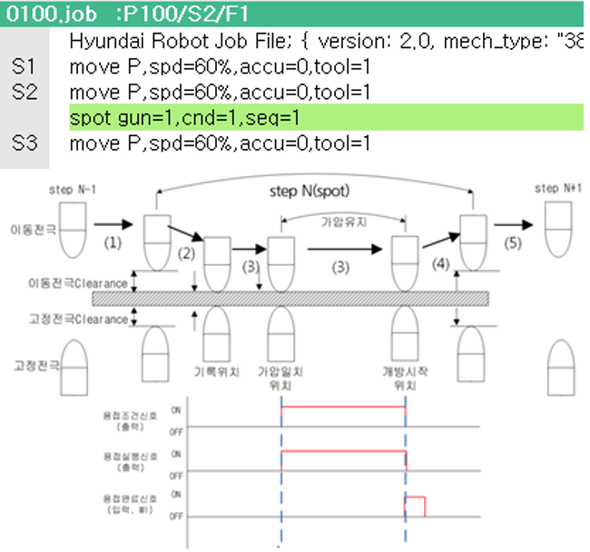

# 4.2.2.1 Servo gun

If the gun type is servo gun, the spot welding function is played back as shown in the figure below.

 </img>
 <em>
Figure 4.8 Playback of servo gun spot welding
</em>

>1. At the N-1 step position, the moving and fixed electrodes move to the positions away from the record positions as much as the ‘moving electrode clearance’ and ‘fixed electrode clearance’, respectively.
>2. With the robot equalizing operation, the fixed electrode moves to the record position of the step, and the moving electrode moves to the record position of the step by shifting as much as the consumption amount.
>3. The moving electrode performs the squeezing operation with the set squeezing force. When the squeezing force is matched, the welding execution signal is outputted together with the welding condition signal at the position.
>4. When the welding completion signal (WI) is inputted, the moving and fixed electrodes open as much as the individual clearances.
>5. Movement to the next step occurs.
