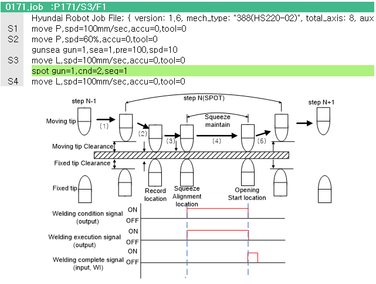

### 4.2.2.1 伺服枪

如果枪类型是伺服枪，则点焊功能如下面的图所示回放。

 </img>
 <em>
图 4.8 伺服枪点焊的回放动作
</em>

 

1. 在 N-1 步骤位置，移动电极和固定电极分别按移动电极间隙和固定电极间隙远离其记录位置。

2. 通过机器人均衡操作，固定电极移动到步骤的记录位置，移动电极在消耗量的影响下移动到记录位置。

3. 移动电极使用指定的挤压力进行挤压操作。当达到目标挤压力时，在该位置输出焊接执行信号和焊接条件信号。

4. 当接收到焊接完成信号 (WI) 时，移动电极和固定电极按各自的间隙量打开。

5. 系统移动到下一步骤。