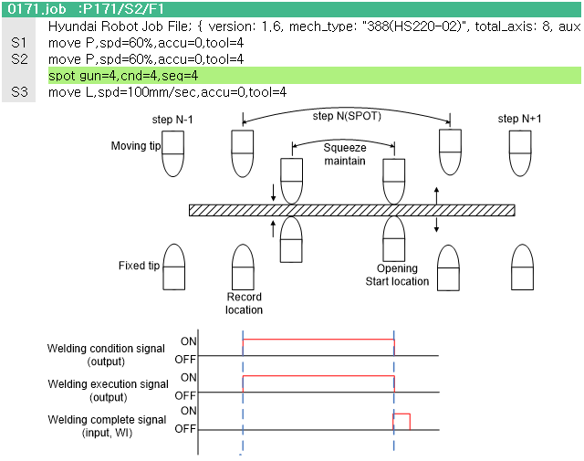

### 4.2.2.2 无平衡器枪

如果枪类型是无平衡器枪，则点焊功能如下面的图所示进行回放。

 </img>
 <em>
图 4.9 无平衡器枪的点焊回放
</em>

 

1. 在 N-1 步骤位置，固定电极离记录位置按固定电极间隙移动。

2. 通过机器人平衡操作，固定电极移动到步骤的记录位置，气动压力使移动电极挤压面板。

3. 当达到目标挤压力时，焊接执行信号与该位置的焊接条件信号一起输出。

4. 当接收到焊接完成信号 (WI) 时，固定电极按固定电极间隙离开记录位置，移动电极移动到不再供气的状态。

5. 系统移动到下一个步骤。