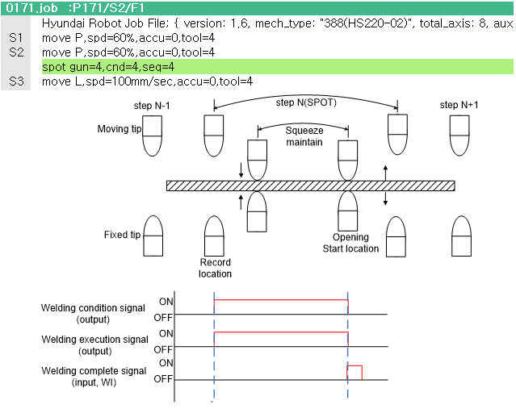

### 4.2.2.3 配备平衡器的枪

如果枪的类型是配备平衡器的枪，点焊功能将如下面的图所示进行回放。

 </img>
 <em>
图 4.10 配备平衡器的枪的点焊回放
</em>

 

1. 在 N-1 步骤位置，机器人移动到记录的步骤位置。

2. 焊接执行信号与焊接条件信号一起输出。平衡装置使固定电极压紧面板，气动压力使移动电极压紧面板。

3. 当接收到焊接完成信号 (WI) 时，固定电极移动到平衡装置不活动的位置，移动电极移动到不供应气动压力的位置。

4. 系统移动到下一个步骤。