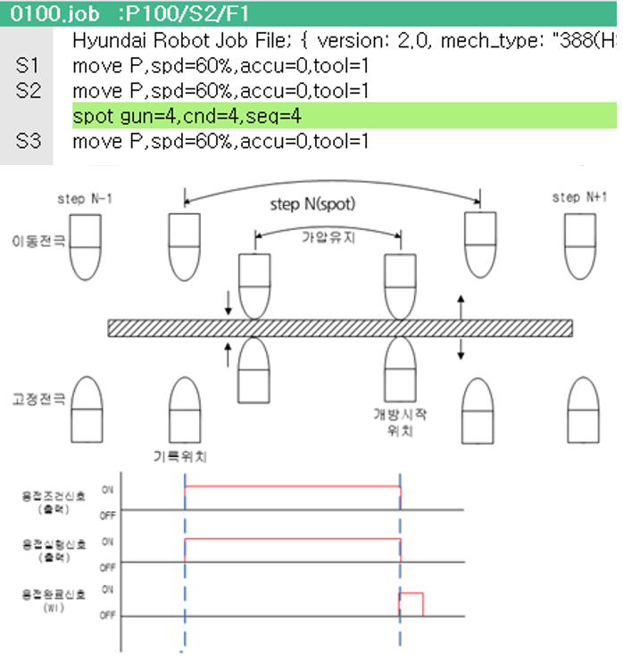

# 4.2.2.3 Equalizer-fitted gun

If the gun type is equalizer-fitted gun, the spot welding function is played back as shown in the figure below.

 </img>
 <em>
Figure 4.10 Playback of spot welding by an equalizer-fitted gun
</em>

>1.At the N-1 step position, movement to the record position of the step occurs.
>2. The welding execution signal is outputted together with the welding condition signal. The equalizing facility makes the fixed electrode squeeze the panel and the pneumatic pressure makes the moving electrode squeeze the panel.
>3. When the welding completion signal (WI) is inputted, the fixed electrode moves to a position where the equalizing facility does not operate and the moving electrode moves to a position where pneumatic pressure is not supplied.
>4. Movement to the next step occurs.