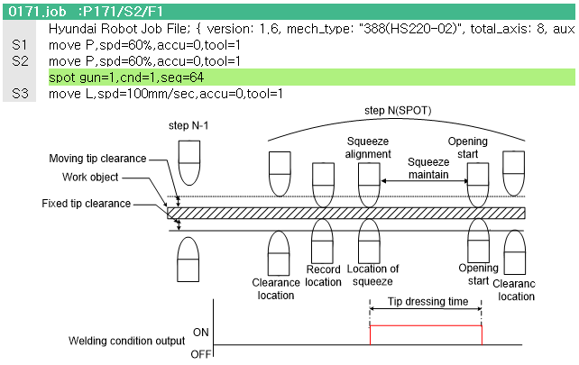

### 4.3.2 Type of operation

To perform a tip dressing operation using the servo tip dressing condition, the welding sequence number in the `spot` statement must be designated as 64 as shown below.

 </img>
 <em>
Figure 4.11 Servo gun tip dressing operation
</em>

 

1. At the N-1 step position, the moving electrode moves away from the recorded position by the amount of the moving electrode clearance, and the fixed electrode moves away from the recorded position by the amount of the fixed electrode clearance.

2. The robot moves to the recorded position of the step.

3. The moving electrode performs the squeezing operation using the squeezing force set in the welding condition. When the target squeezing force is reached, the welding condition signal is output at that position. Whether the welding execution signal is also output at this time depends on the “Welding signal output” setting in the tip dressing condition.

4. After the configured tip dressing time has elapsed, the moving and fixed electrodes open by their respective clearance amounts.

5. The system moves to the next step.