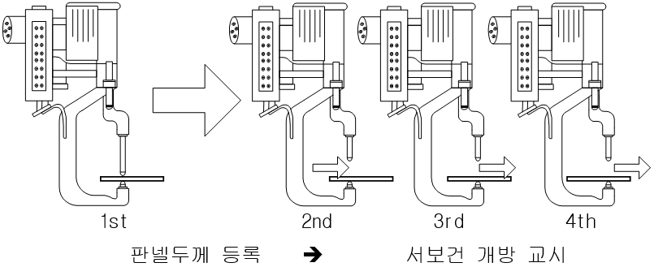

# 4.4.2 How to teach

(1)  In a state that the panel thickness is registered, proceed with teaching while keeping the moving electrode open and only the fixed electrode in contact with the panel.

 </img>
 <em>
Figure 4.13 Method of working when the panel thickness is the same
</em>

 

(2) When the panel thickness is changed, perform teaching after registering the panel thickness again.
