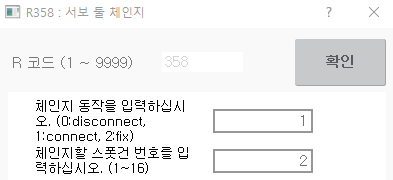

# 4.5.2 접속/분리 명령

서보툴 체인지 환경에서 서보건의 접속/분리는 아래 2가지로 수행할 수 있습니다. 서보건을 접속하면 건번호와 툴번호가 설정된 값에 따라 자동 변경되며, 서보건을 분리하면 건번호와 툴번호가 0으로 자동 변경됩니다.

(1) R358

R코드에 의한 서보건 체인지 기능으로 수동 모드의 모터 On 상태에서(Enable 스위치 On) 사용합니다.

<Br>

- 조작 순서 : **R358 → #1 → #2**

| **파라미터** |   **#1**   | **#2** |
| :------: | :--------: | :----: |
|    의미    |    접속/분리    |     건번호     |
|   설정 값   | 접속=1, 분리=0 | 체인지할 서보건 번호 |

<br>

- 사용 예

| 접속 |   분리   | 
| :------: | :--------: | 
|    서보건 G2 접속  |     서보건 G1 분리     |   
|    R358 → 1 → 2    |    R358 → 0 → 1    |    
|        |       |   


<Br>

(2) toolchng

작업 프로그램 실행에 의한 용접건 체인지 기능입니다.


```toolchng``` on/off,tg=<체인지 대상>,di=<접속완료 신호>,wait=<접속완료 대기시간(sec)>

<br>

|  파라미터   |   입력  |   기능    |  비고   |
|:---------: | :-----: | :------: | :------: |
|   **접속** |       **on**       |    서보툴 접속       |        |
|   **분리** |       **off**      |     서보툴 분리      |        |
|   **체인지 대상** |     **G1\~G16**    |  접속/분리할 용접건 번호 |  |
|   **기계적 접속완료 확인신호**   | **1\~4096**| <p>기계적인 접속완료</p><p>확인을 위한</p><p>입력신호 번호</p> | off시 N/A |
|  <p><strong>접속완료</strong></p><p><strong>대기시간</strong></p>  | **<0\~5.0>** | <p>접속완료 대기시간</p><p>(파라미터가 없거나 0이면 무한대기)</p> |   off시 N/A  |
| <p><strong>체인지 대상</strong></p><p><strong>(동시 접속/분리)</strong></p> |**G1\~G16**|접속할 용접건 | off시 N/A  |

<br>

접속완료는 기계적인 접속과 로봇 제어기 내부 처리가 끝나야 완료 처리가 됩니다. 접속완료 대기시간은 위 2가지 과정이 모두 완료될 때까지 대기하는 시간입니다.
