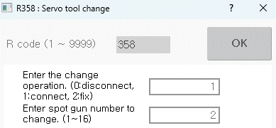
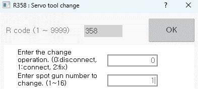

### 4.5.2 Connection/disconnection commands 

In the servo tool change environment, connection/disconnection of the servo gun can be done in two ways as below. When the servo gun is connected, the gun number and tool number are automatically changed according to the set values, and when the servo gun is separated, the gun number and tool number are automatically changed to 0.

(1) R358

This is a function for servo gun change by using a R code, and can be used in the motor on state (the enable switch is on) in manual mode.

 - Operation = `R358 --> 1 --> 2`

| **Parameter** |   **#1**   | **#2** | 
| :------: | :--------: | :----: | 
|    Meaning    |    Connection/disconnection  |     Gun number     |
|   Setting value   | Connection=1, Disconnection=0 | The number of the gun targeted for change |

 - Example of use  

| Connection | Disconnection|
| :--: | :--:|
| Gun #2 connection |Gun #1 disconnection|
| `R358 + 1 + 2` | `R358 + 0 + 1` |
|   |   |

<br>

(2) toolchng

This is a function for welding gun change through the execution of a work program. 

```python
toolchng on/off/fixed,tg=<target guns for change>,is=<connection complete signal>,wait=<connection complete wait time>
```

<br>

|    parameter |       input       |     function     |   note   |
| :-----------: | :----------: | :---------: | :-----------: |
|     connection |       on       |      connection of the servo tool     |      |
|  disconnection |       off     |        disconnection of the servo tool   |      |
|  fixed change |       fixed      |      power-on tool change   | single motor multi-tool     |
|     target guns for change |     G1\~G16    |        numbers of the welding guns, <br> array [ ] for multi guns (ex. ["G1", "G2"])        | connection/disconnection of the relevant additional axes  |
|mechanical connection check signal|     1~4096    | number of the input signal <br> for mechanical connection completion |    parameter to be ignored in off state |  
| connection wait time  | <0~5.0> <br> (sec) | connection completion wait time <br> (limitless waiting if no parameter exists or the value is 0)</p> |  parameter to be ignored in off state  |

<br>

Connection completion will be finalized only after the mechanical connection and the internal processing of the robot controller are completed. The connection completion wait time is the time for waiting until both of the above two processes are completed.
