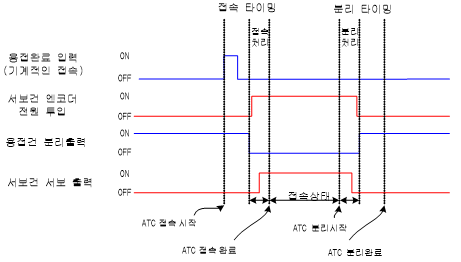

# 4.5.3 Connection/separation timing

 </img>
 <em>
Figure 4.17 Connection and seperation timing chart
</em>

*   Connection

    If the robot and servo gun are mechanically connected during the execution of the connection command (toolchng on), the connection completion signal will be inputted, the connection will be processed inside the controller, the encoder power for driving the axis of the servo gun will be inputted, and the motor on operation will be executed.
*   Separation

     The separation command will execute the processing of the separation according to the sequence opposite to that of the connection command.
