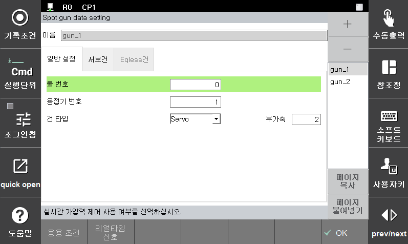

# 4.5.1.1 건 번호 대응 툴번호, 건타입 설정

『**설정**』 → 『**4: 응용 파라미터**』 → 『**1: 스폿용접**』 → 『**1: 건번호 대응 툴번호, 건타입 설정**』에서 서보툴 체인지 대상의 건타입과 툴 번호를 지정합니다.

 </img>
 </img>
 <em>
그림 4.14 스폿 건 추가
</em>

그림4.14는 아래와 같이 2개의 서보건을 설정한 예입니다.

* **Gun1**: 용접기 1, 툴 번호 0, 서보건, 부가축 2 -> 서보툴 파라미터를 설정 필요
* **Gun2**: 용접기 1, 툴 번호 1, 서보건, 부가축 1 -> 서보툴 파라미터를 설정 필요

서보툴 체인지 대상 중 서보건으로 설정된 건은 다음 장과 같이 해당 서보건의 서보툴 파라미터를 설정해야 합니다.
