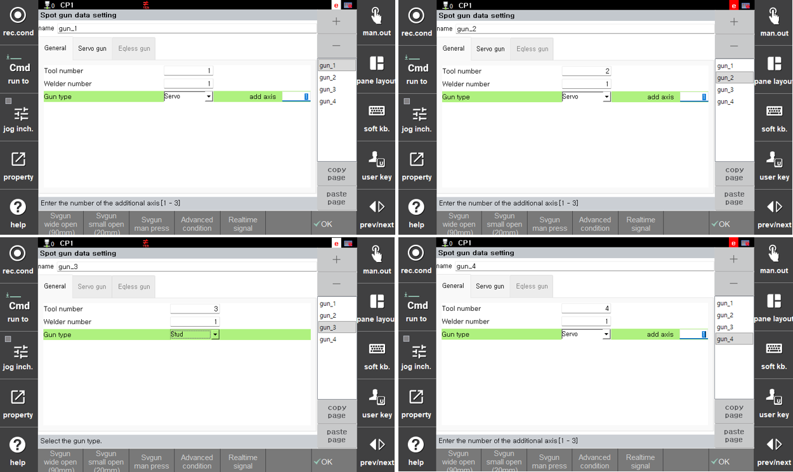

# 4.5.1.1 Setting of the tool number and gun type corresponding to the gun number

In『**Setting**』 → 『**4: Application parameter**』 → 『**1: Spot welding**』 → 『**1: Setting of the tool number and gun type corresponding to the gun number**』, set the gun type and tool number targeted for the servo tool change.

 </img>
 <em>
Figure 4.14 Addition of a spot gun
</em>

The figure 4.14 shows a case in which two servo guns are set as below.

* **Gun1**: Welder 1, tool number 1, servo gun, additional axis 2 -> Required to set the servo tool parameters
* **Gun2**: Welder 1, tool number 2, servo gun, additional axis 1 -> Required to set the servo tool parameters
* **Gun3**: Welder 1, tool number 3, stud gun, additional axis X -> Not required to set the servo tool parameters
* **Gun4**: Welder 1, tool number 4, servo gun, additional axis 1 -> Required to set the servo tool parameters

 In the case of s gun set as servo gun, among the targets for servo tool change, the servo tool parameters of the concerned servo gun should be set as shown in the next section.

 


 
 All welding guns used for welding gun change must use the same welding controller.
  
