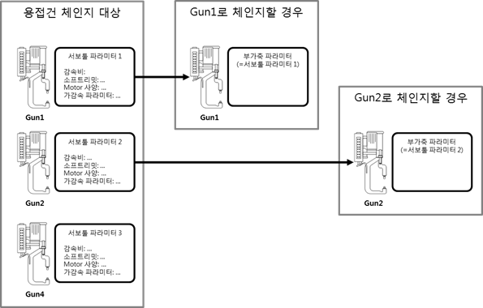
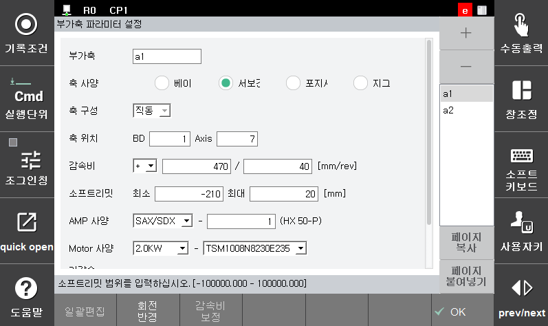

# 4.5.1.2 Servo tool parameter setting

 In『**Setting**』 → 『**4: Application parameter**』 → 『**11: Servo tool change**』 → 『**2: Servo tool parameter setting**』, set the gun type and tool number targeted for the servo tool change.

If the gun targeted for servo tool change is a servo gun, you need to set the parameter of the servo gun you want to use because the currently set parameter for the additional axis and the parameter of the servo gun you want to use may be different. When another welding gun is used with the welding gun change function, the set parameter will replace the value of the existing parameter for the additional axis, as shown in the figure below, the same setting items as the parameter for the additional axis are used.

 </img>
 <em>
Figure 4.15 Application of the parameter for the additional axis during tool change
</em>

The setting items of the parameter for the servo tool are mostly the same as the setting items of the parameter for the additional axis. You need to add the servo gun that you have set in the screen for setting the tool number and gun type corresponding to the gun number. When the OK button is clicked, the additional axis number corresponding to the gun number will be automatically set.

 </img>
 <em>
Figure 4.16 Additional axis parameter setting screen
</em>

