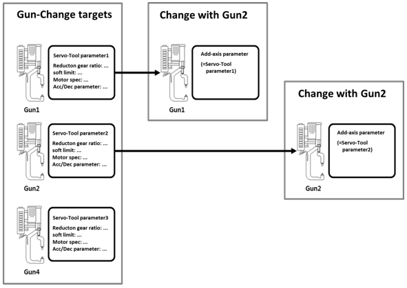
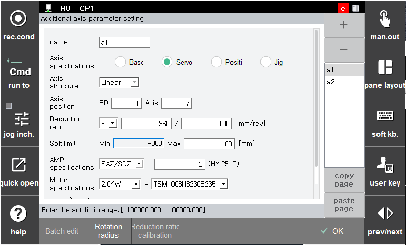

### 4.5.1.2 伺服工具参数设置

在`[F2: 系统] - 4: 应用参数 - 11: 伺服工具更换 - 2: 伺服工具参数设置 ([F2: system] - 4: Application parameter - 11: Servo tool change - 2: Servo tool parameter setting)`菜单中，设置用于伺服工具更换的枪类型和工具编号。

如果用于伺服工具更换的枪是伺服枪，则需要设置您希望使用的伺服枪的参数，因为当前设置的附加轴参数与您希望使用的伺服枪参数可能会不同。当使用焊接枪更换功能时，设置的参数将替换附加轴现有参数的值，如下图所示，与附加轴参数相同的设置项将被使用。

 </img>
 <em>
图 4.15 工具更换过程中附加轴参数的应用
</em>

伺服工具的参数设置项大多与附加轴的参数设置项相同。您需要在设置枪编号和枪类型的屏幕中添加您已设定的伺服枪。当点击确认按钮时，枪编号对应的附加轴编号将被自动设置。

 </img>
 <em>
图 4.16 附加轴参数设置屏幕
</em>

