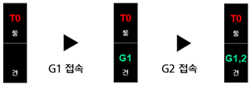

# 4.6.1 Manual selection of multiple guns

 </img>
 <em>
Figure 4.19 Additional axis parameter setting screen
</em>

The procedure for selecting G1 (master) and G2 (slave) as multiple guns through the servo tool change function is as follows.

1. Select \[**R**]+\[**358**] and then connect G1. After the connection is completed, the parameter related to the additional axis to which G1 is assigned should be set.
2. Select \[**R**]+\[**358**] and then connect G2. After the connection is completed, the parameter related to the additional axis to which G2 is assigned should be set.
3. The state of the selected gun is indicated in state flag as follows.


[Note]  
* **\[R]+\[210] for changing the master gun number**
  1. Environment with a sole gun → \[R]+\[210]+\[3] → Environment with a sole gun (Example: G1 → G3)
  2. Environment with multiple guns → \[R]+\[210]+\[1] → Environment with a sole gun (Example: G1 and G3 → G1)
* **\[R]+\[214] for selecting multiple guns**
  1.  When selecting another number different from the set gun number

      A. Environment with a sole gun → \[R]+\[214]+\[3] → Environment with multiple guns (Example: G1 → G1 and G3)

      B. Environment with multiple guns → \[R]+\[214]+\[2] → Environment with multiple guns(Example: G1 and G3 → G1, G3, and G2)
  2.  When selecting the same number as the set gun number

      A. Environment with multiple guns → \[R]+\[214]+\[3] →  Environment with multiple guns(Example: G1, G3 and G2 → G1 and G2)

      B. Environment with multiple guns → \[R]+\[214]+\[2] → Environment with a sole gun (Example: G1 and G2 → G1)

      C. The master gun number does not change.


