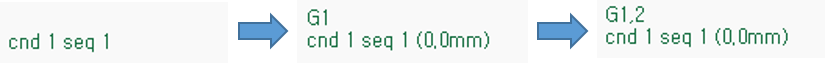

### 4.6.1 手动选择多个枪

 </img>
 <em>
图 4.19 应用多枪的屏幕
</em>

通过伺服工具更换功能选择 G1（主枪）和 G2（从枪）作为多个枪的程序如下。

1. 选择 `R358` 然后连接 G1。连接完成后，应设置与 G1 分配的附加轴相关的参数。
2. 选择 `R358` 然后连接 G2。连接完成后，应设置与 G2 分配的附加轴相关的参数。
3. 所选枪的状态在状态标志中如下所示。

 


* `R210` 用于更改主枪编号
  - 单枪环境  --> `R210 + 3`  --> 单枪环境（示例：G1  --> G3）
  - 多枪环境  --> `R210 + 1`  --> 单枪环境（示例：G1 和 G3  --> G1）
* `R214` 用于选择多个枪
  -  当选择与设定枪编号不同的另一个编号

      A. 单枪环境  --> `R214 + 3`  --> 多枪环境（示例：G1  --> G1 和 G3）

      B. 多枪环境  --> `R214 + 2`  --> 多枪环境（示例：G1 和 G3  --> G1、G3 和 G2）
  -  当选择与设定枪编号相同的编号

      A. 多枪环境  --> `R214 + 3`  -->  多枪环境（示例：G1、G3 和 G2  --> G1 和 G2）

      B. 多枪环境  --> `R214 + 1`  --> 单枪环境（示例：G1 和 G2  --> G1）

      C. 主枪编号（G1）不变。  
