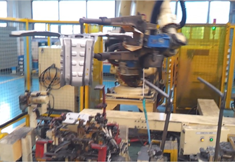

# 4.8 서보건 기반 작업물 핸들링

크기가 작은 작업물은 별도의 행거 없이 서보건을 이용해서 이송하기 위한 기능입니다.

<p align="center">
 </img>
 <em><p align="center">그림 4.21 서보건 핸들링 기능</p></em>
</p>

“**svclamp**”명령문을 이용해서 작업물을 잡는 동작과 개방 동작을 수행할 수 있습니다. svclamp on 상태에서는 서보건이 개방되지 않습니다.

<br>


### 문법

```python
svclamp on/off gun=[건번호],cnd=[조건번호]
```

<br>


### 파라미터

|   항목   | 　    의미    | 
| :-----------: |:-----------: |
|    on/off    | 클램핑 건의 가압, 해제를 지정 | 
|    건번호    | 클램핑 건 번호를 지정 |
|    조건번호   | 클램핑 조건을 지정  |


<br>

### 사용 예

```python
S10	  move L, ...				#작업물 파지 위치로 이동
	  svclamp on,gun=1,cnd=1	#서보건으로 작업물을 파지
S11	  move L, ...				#로봇이동
S12	  move L, ...				#로봇이동
S13	  move L, ...				#로봇이동
S14	  move L, ...				#작업물 파지 해제 위치로 이동
	  svclamp off,gun=1,cnd=1   #작업물 파지 해제
S15	  move L, ...				#로봇이동
```