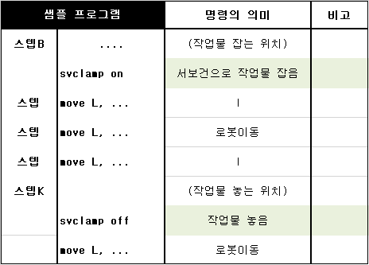

# 4.8 Handling of workpieces with the servo gun

 This is a function to transport a workpiece in small size without using a separate hanger.

 </img>
 <em>
Figure 4.21 Servo gun's handling function
</em>

The “**svclamp**” statement can be used to hold a workpiece and perform opening operation. In the svclamp on state, the servo gun does not open.

 </img>
 <em>
Figure 4.22 svclamp command program
</em>

