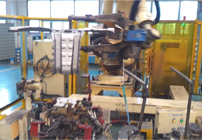

# 4.8 Handling of workpieces with the servo gun

 This is a function to transport a workpiece in small size without using a separate hanger.

<p align="center">
 </img>
 <em><p align="center">Figure 4.21 Servo gun's handling function</p></em>
</p>

</br>

```svclamp on/off gun=<gun number>,cnd=<condition number>```


|   **Item**    |        **Content**       |
| :--------: |:---------: |
|    **on/off**    |  on: clamping, off: releasing |
|    **Gun number**    |  the welding gun number (array [ ] for multi-guns) |
|    **Condition number**   |  the welding condition |


<br>


The "**svclamp**" statement can be used to hold a workpiece and perform opening operation. In the svclamp on state, the servo gun does not open.


<br>

```python

S10   move L, ...                    # Move to a holding position
      svclamp on, gun=1, cnd=1       # Hold the workpiece using a servo gun
S11   move L, ...                    # Robot movement
S12   move L, ...                    # Robot movement
S13   move L, ...                    # Move to a releasing position
      svclamp off, gun=1, cnd=1      # Release the workpiece 
S12   move L, ...                    # Robot movement

```