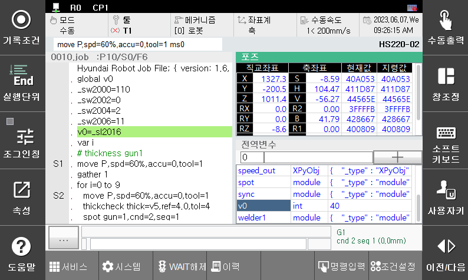

# 4.9 스폿용접 타점 계산

스폿 용접의 타점을 저장하는 기능은 내장 PLC에서 제공합니다. 초기화, 전원 온, 지난 사이클 및 현재 사이클의 용접 타점 횟수를 각각 저장하고 있으며 사용자가 임의 초기화 할 수 있습니다. 자세한 내용은 내장 PLC 설명서의 [" 3.4.3 S릴레이- OP_TIME"](https://hrbook-hrc.web.app/#/view/doc-hi6-embedded-plc/korean/3-relay/4-sw-relay/3-slot-op-time) 항목을 참고하시기 바랍니다.

 

 </img>
 <em>
그림 4.22 스폿 타점 확인
</em>

 


\[**주의**]: 서브 태스크에서 수행한 spot 명령어는 계산되지 않습니다.


