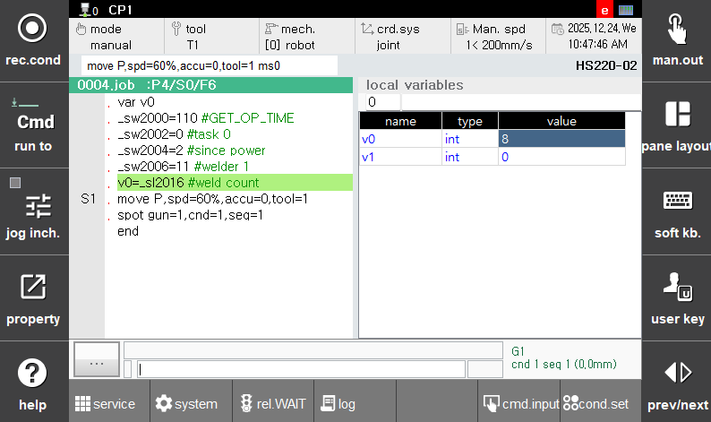

# 4.9 Calculation of spots in spot welding

The function for storing spot welding point counts is provided by the built-in PLC. The PLC stores the number of welding points for initialization, power-on, the previous cycle, and the current cycle, respectively, and the user can reset these values manually.

For more details, refer to “[3.4.3 S Relay – OP_TIME](https://hrbook-hrc.web.app/#/view/doc-Hi6-embedded-plc/english/3-relay/4-sw-relay/3-slot-op-time)” in the Built-in PLC Manual.

 </img>
 <em>
Figure 4.22 Spot count
</em>

 


The spot command executed in the sub task will not be calculated.


