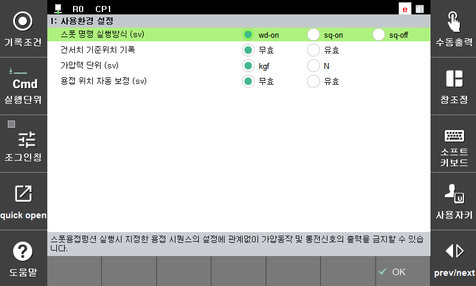

# 5.1 사용환경 설정

스폿용접과 관련된 사용환경을 설정하여 상황에 맞는 적절한 동작을 수행합니다.

 </img>
 <em>
그림 5.1 스폿 사용환경 설정 화면
</em>

 

(1)  **서보건 스폿명령 실행 방식**
    
    spot 명령문을 실행할 때 해당 건의 타입이 서보건인 경우는 용접시퀀스의 설정에 관계없이 가압동작 실행과 용접신호의 출력을 금지할 수 있습니다. 따라서, 이 기능은 티칭 위치 확인에 유용하게 사용할 수 있습니다. 이 설정 상태에 따라 스폿용접을 실행하는 시퀀스가 다음과 같이 동작됩니다.

|출력방식| 
 내용 
|  
|:---:|----------------------------------------------------|  
|Wd-On|스폿용접 펑션에 지정한 용접시퀀스를 모두 실행합니다.   클리어런스 위치 → 가압 → 가압일치 검사 →   용접신호 출력 →용접완료 대기 → 클리어런스 위치 |
|Sq-On|용접과 관련된 신호를 제외하고 용접시퀀스를 실행합니다.   클리어런스 위치 → 가압 → 가압일치 검사 → 클리어런스 위치|
|Sq-Off|가압동작, 통전신호출력, WI대기등을 모두 하지 않습니다. 클리어런스 위치|

 

(2)  **건서치 기준위치 기록**

    팁의 마모량을 제어기가 관리하는 건타입(서보건, EQless건)인 경우는 마모량을 산출하기 위한 기준 위치가 결정되어야 하며 이를 기준으로 실제 마모량을 산출합니다.
    
-   무효
  
      결정된 기준위치를 바탕으로 마모된 실제 마모량을 산출합니다.
-   유효
      마모량 산출을 위한 기준위치를 결정하므로 새팁을 부착한 상태에서 초기에 한번만 수행하면 됩니다.

(3)  **서보건 가압력 단위**

    서보건 제어를 위한 가압력의 단위를 선택합니다.
(4)  **서보건 용접스텝 기록위치 자동조정**

    spot 명령 수행 시 건을 가압한 상태에서 측정된 판넬 두께와 마모량을 고려하여 기록된 move문의 서보건 위치를 조정할 지 여부를 선택합니다. 티칭을 완료한 후 또는 서보건에 변형이 생긴 경우에“유효”로 설정하고 작업 프로그램을 1회 자동 재생하면 간단하게 최적의 조건으로 기록위치를 조정해 주기 때문에 유용하게 활용할 수 있습니다.

