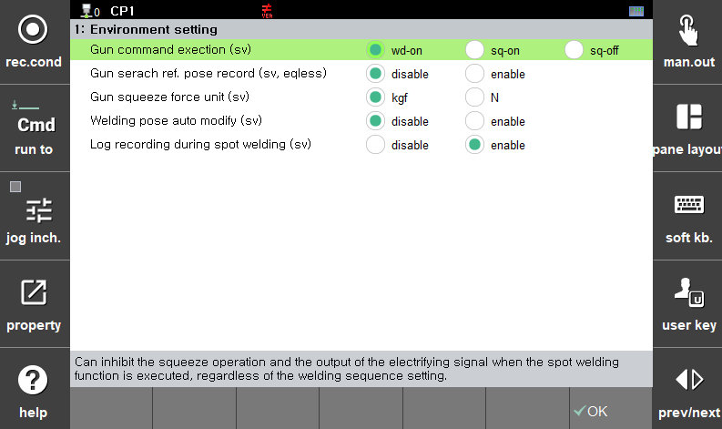
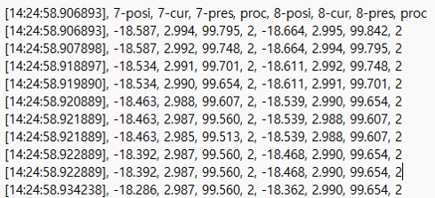
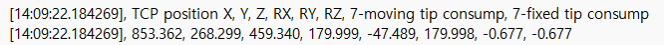

# 5.1 Use environment setting

Sets the use environment related to spot welding to perform appropriate operation for given situations.

 </img>
 <em>
Figure 5.1 Spot use environment setting screen
</em>

 

(1)  **Servo gun spot statement execution method**
  - During the execution of the `spot` statement, if the selected gun type is a servo gun, the squeezing operation and welding signal output can be inhibited regardless of the welding sequence. This function is useful for verifying the teaching position. The spot welding execution sequence will vary depending on the status of this setting.

|Output method| 
 Content 
|  
|:---:|----------------------------------------------------|  
|Wd-On|Executes every welding sequence designated in the spot welding function.   Clearance position → Squeezing → Squeezing force matching inspection → Welding signal output   → Welding completion wait → Clearance position |
|Sq-On|Executes the welding sequence except for the signals related to welding.   Clerance position → Squeezing → Squeezing force matching inspection → Clerance position|
|Sq-Off|Does not perform squeezing operation, electrification signal output, WI wait, etc. Clearance position|

 

(2)  **Gun search reference position record**
  - In the case of a gun type (servo gun, equalizerless gun) for which the controller manages the tip consumption amount, the reference position should be determined first, and then the actual c35onsumption amount will be calculated based on it.
    
  - disable  
   The actual consumption amount is calculated based on the determined reference position.
  - enable  
    As the reference position is to be determined to calculate the consumption amount,  it would be no problem to perform recording once initially while new tips are attached.

(3)  **Unit of the servo gun force**  
  - Selects the unit of the squeezing force for the control of the servo gun.

(4)  **Automatic adjustment of servo gun welding step record position**
  - Selects whether to adjust the position of the servo gun in the `move` statement recorded in consideration of the panel thickness measured while the gun is squeezed during the execution of the `spot` statement. Set it to "enable" after teaching is completed or deformation of the servo gun has occurred. After that, play back the work program once in automatic mode, then the record position will be simply adjusted based on optimal conditoins. With those features, this function can be usefully applied.

(5) **Servo Gun Real-Time Data Storage Function**
  - During spot welding, specified data are saved to a file at 2 ms intervals. The stored data can be used for welding quality inspection and analysis.
      
      -  Collection time, position, current, pressurization force, welding progress status    

 </img>
 <em>
Figure 5.1.1 Real-Time Data Storage
</em>

  
  - Each time a gun search is performed, specified data are saved to a file.
      
      -  Collection time, robot tool-end position, moving electrode wear amount, fixed electrode wear amount

 </img>
 <em>
Figure 5.1.2 Gun Search Data Storage
</em>

 

  
 To enable this function, the "Spot Welding Option Function" must be set to Enabled on the license key registration screen.  
