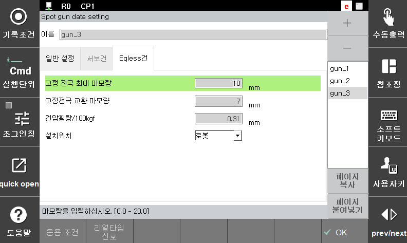

### 5.2.2. Eqless건

건타입이 "Eqless"건이면 아래와 같이 Eqless건과 관련된 파라미터를 설정하는 화면이 표시됩니다.

</img>
<em>
그림 5.8 Eqless 건 설정
</em>

(1)  **고정전극 최대 마모량(mm)**
- egunsea에 의해 측정된 마모량이 여기에 설정된 값을 초과할 때 에러가 발생합니다.

(2)  **고정전극 교환 마모량(mm)**
-  egunsea에 의해 측정된 마모량이 여기에 설정된 값을 초과할 때 경고를 출력합니다.

(3)  **건암휨량/100kgf (mm)**
-   가압력에 의한 건 암의 휨량을 100Kgf에 대한 휨량으로 설정합니다. 스폿용접 수행 시 고정전극의 위치를 이 설정치와 지령 가압력으로부터 건 암 휨량을 산출하고 이를 보정하여 가압합니다.

(4)  **설치위치**
-   Eqless건의 설치위치가 '로봇'인지 '작업대'인지 선택합니다.

