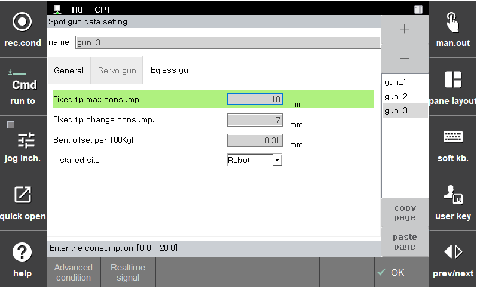

### 5.2.2. 无平衡器枪

如果枪类型为“无平衡器枪”，将显示如下所示的无平衡器枪参数设置屏幕。

</img>
<em>
图 5.8 无平衡器枪设置
</em>

 

(1)  **固定尖端最大消耗量 (mm)**
   - 如果通过 `egunsea` 语句测量的消耗量超过这里设置的值，将会产生错误。

(2)  **固定尖端更换消耗量 (mm)**
   - 如果通过 `egunsea` 语句测量的消耗量超过这里设置的值，将会发出警告。

(3)  **每 100kgf 的弯曲补偿**
   - 设置每 100 kgf 的弯曲补偿量。

(4)  **安装地点**
   - 选择所选的无平衡器枪是机器人枪还是静止枪。