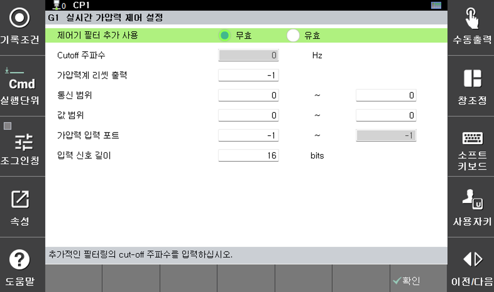

#### 5.2.1.1.1 실시간 가압력 제어

실시간 가압력 제어는 가압력계로 측정한 데이터를 제어에 활용하여 서보건 가압력의 정확도를 향상시키는 기능입니다. 실시간 가압력 제어를 위해 가압력계는 로봇제어기와 통신을 해야 하고, 아래 메뉴로 통신사양을 설정합니다. 디지털 방식의 데이터만 수신 가능하기 때문에 센서의 아날로그 출력 신호는 디지털 컨버터를(ADC) 통해서 제어기로 입력되어야 합니다.

</img>
<em>
그림 5.6 실시간 가압력 제어 설정
</em>

 

-  제어기 필터 추가 사용 : 제어기 필터가 추가적으로 필요할 경우 유효 선택

-  Cut-off 주파수 : 제어기 필터 추가 사용을 유효로 설정 할 경우 활성화되고 필터의 크기를 설정

-  가압력계 리셋 출력 : 가압력계 초기화를 위해 출력할 신호를 할당하여 서보건이 가압을 할 때마다 신호 출력 (ex. 키슬러)

-  통신 범위: 할당된 신호의 최소, 최대 범위

-  값 범위: 할당된 신호의 최소, 최대 값

-  가압력 입력 포트 : 입력을 위해 할당된 신호의 주소
    
-  입력 신호 길이 : 신호에 할당된 비트 수

-  게인 (p, i, d, pr) : 가압력 제어 성능 튜닝 파라미터 (개발자 모드에서만 수정 가능)

