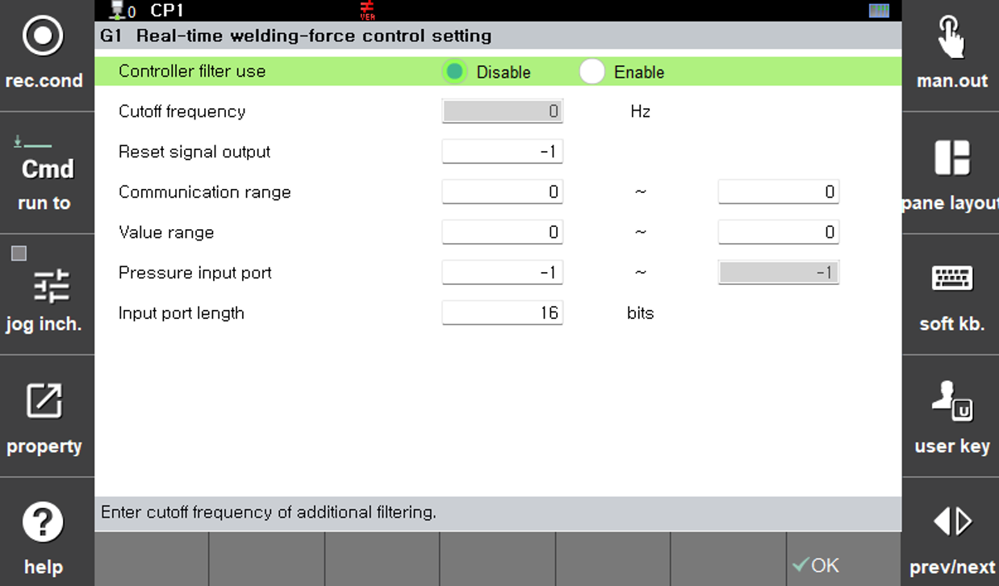

# 5.2.1.1.1 Real-time squeezing force control

Real-time pressurization force control improves the accuracy of servo gun force by using data measured by a force sensor for control. To enable real-time pressurization force control, the force sensor must communicate with the robot controller, and the communication specifications are configured in the menu below.

Since only digital data can be received, the sensor's analog output signal must be input to the controller through an analog-to-digital converter (ADC).

</img>
<em>
Figure 5.6 Setting of real-time squeezing force control
</em>

 

-  Controller filter use (optional): Enable if an additional controller filter is required.

-  Cut-off frequency: Activated when the controller filter is enabled; sets the filter bandwidth.

-  Reset signal output: Assigns an output signal for force sensor initialization, which is triggered each time the servo gun applies pressure (e.g., Kistler).

-  Communication range: Sets the minimum and maximum range of the assigned signal.

-  Value Range: Sets the value range of the assigned signal.

-  Pressurization input port: The address of the signal assigned for input.

-  Input port length: The number of bits assigned to the signal.