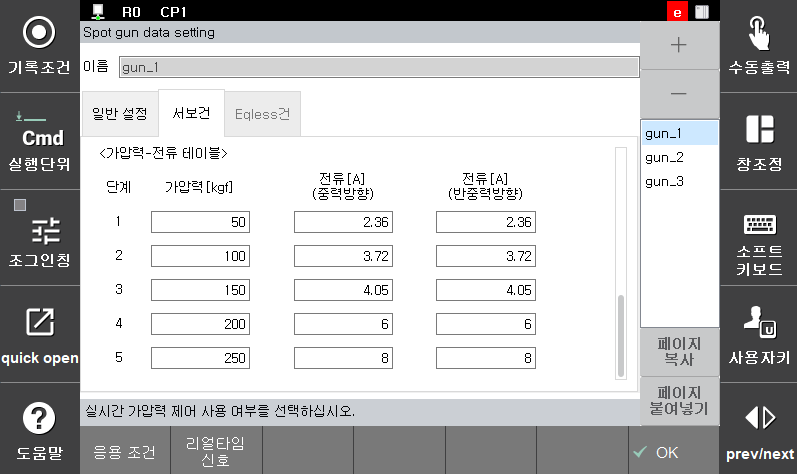
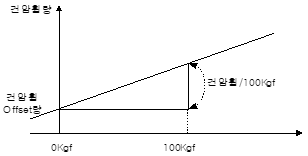
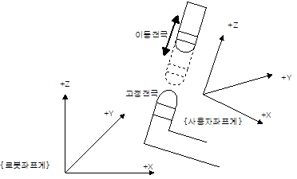
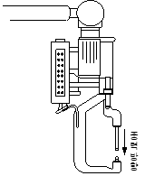
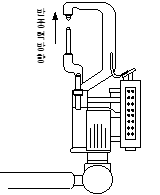

# 5.2.1.1 Servo gun default setting

</img>
</img>
<em>
Figure 5.2 Servo gun default setting screen
</em>

(1)  **Distance during manual opening operation (mm)**

    Designates the target position in performing wide and narrow opening operations of the servo gun by using the user key.
(2)  **Maximum electrode consumption amount (mm)**

    If the moving or fixed electrode consumption amount detected through gun search exceeds the set value, an error will be outputted and the operation will stop.
(3)  **Electrode replacement required consumption amount (mm)**

    If the moving or fixed electrode consumption amount detected by gun search exceeds the value set here, an electrode consumption alarm signal, together with a warning message, will be outputted to notify the need for replacement of the electrode. When it is set to 0.0 mm, abnormality will not be detected.
(4)  **Gun arm deflection amount/100\[Kgf]\(mm)**

    Sets the amount of gun arm deflection caused by the squeezing force to a deflection amount for 100 kgf. During the spot welding, squeezing will be performed by calculating the gun arm deflection amount not only from this set value and also from the command squeezing force.

</img>
<em>
Figure 5.3 Gun arm deflection amount/100Kgf graph
</em>

(5)  **Degree of squeezing force (%)**

    During the squeezing force matching process, squeezing force matching detection will occur if the real squeezing force reaches within the range of the accuracy of squeezing force, in comparison to the command squeezing force. If this value is set to 0, the notification 『W0110 Set in a way that squeezing force detection does not occur』 will be outputted and squeezing force matching will not be performed.
(6)  **Time for detection of abnormal squeezing force (s)**

    Sets the time from the start of squeezing to the matching of squeezing force. If squeezing force matching occurs within this time, the welding signal will be outputted immediately. If squeezing force matching does not occur, the notification 『**E1314 Exceeds the time for detection of abnormal squeezing force**』 will be outputted and stopping will occur. If the time is set to 0.0 sec, the squeezing force matching detection will continue to wait.
(7)  **Command value offset (mm)**

    When the Spot statement is executed, a squeezing force should be generated by the servo gun. For this, the moving electrode will be commanded to move to the squeezing position. The squeezing position refers to a position where the ‘command value offset’ is added to the record position in the direction of squeezing.
(8)  **Gun type**

    Selects the type (robot gun, stationary gun) of the selected servo gun. In the case of using a stationary servo gun, the user coordinate system number in which the coordinate system of the stationary gun is set in advance should be set. (it will be the robot coordinate system if the value is 0.). The user coordinate system should be set in a way that the travel direction of the fixed electrode becomes the the Z (+) direction.

</img>
<em>
Figure 5.4 Stationary gun coordinate system
</em>

 
(9)  **Moving electrode consumption amount/Total consumption amount (%)**

    When it comes to the method to measure the consumption amount of the servo gun, one is to perform the measurement only through gun search 1 and the other is to perform the measurement by using both gun search 1 and gun search 2.

    If the value is set to 0. the consumption amount will be calculated by using both gun search 1 and gun search 2. If the value is set to a value other than 0, the total consumption amount measured through gun search 1 will be distributed between the moving electrode consumption amount and fixed electrode consumption amount at the set ratio (%). 
(10)  **Real-time squeezing force control**

    Sets whether to use the real-time squeezing force control function. This is a function to perform controlling to ensure that the set squeezing force can be reached by using the actual squeezing force measured with a squeezing force gauge. If this function is set to valid, the 『 Real-time signal』 key will be activated, making it possible to set the parameter.
(11)  **Squeezing force - current table**

    A squeezing force table can be created in five levels as desired by the user by measuring the squeezing force with a squeezing force gauge. If the squeezing force is set differently for the gravity direction and anti-gravity direction, the compensation for the squeezing force will occur in line with the operating direction of the gun. 

    This squeezing force - current table sets the current values for the squeezing values in five levels. The table should be set in a way that the squeezing force - current value increases as the level goes up. The upper and lower limits inputted for the squeezing force will be used as the limiting range of the squeezing force during playback or manual operation.

</img>
</img>
<em>
Figure 5.5 Gravitation direction and anti-gravitation direction
</em>

