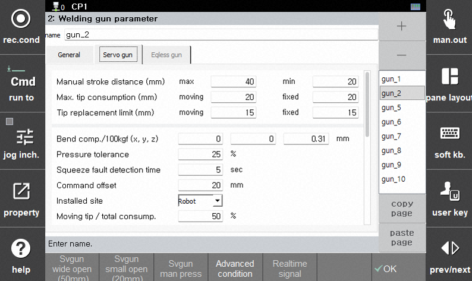
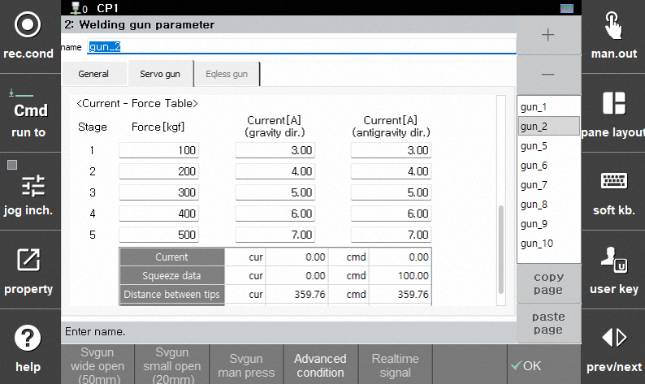
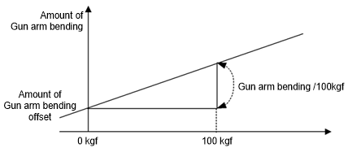
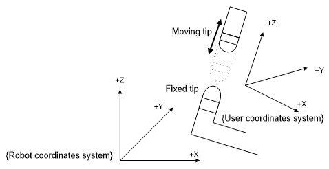
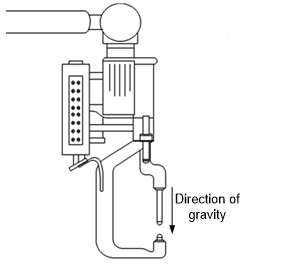
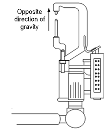

### 5.2.1.1 伺服枪默认设置

</img>
</img>
<em>
图 5.2 伺服枪默认设置屏幕
</em>

(1)  **手动行程距离 (mm)**  
  指定伺服枪在用户按键操作下进行宽开与窄开的目标位置。

(2)  **最大尖头消耗量 (mm)**  
  如果通过枪搜索检测到的移动或固定电极消耗量超过设定值，将产生错误并停止操作。

(3)  **更换尖头消耗量 (mm)**  
  如果通过枪搜索检测到的移动或固定电极消耗量超过此处设置的值，将输出电极消耗报警信号，并附带一条警告信息以指示需要更换电极。
  如果设置为 0.0 mm，将不会检测到异常情况。

(4)  **每 100kgf 的弯曲偏移 (mm)**  
  将因挤压力造成的枪臂偏移设置为每 100 kgf 的偏移量。在点焊过程中，挤压操作是通过基于此设置和命令挤压力计算枪臂偏移进行的。

</img>
<em>
图 5.3 枪臂偏移量/100Kgf 图
</em>

(5)  **压力公差 (%)**  
  在挤压力匹配过程中，当实际挤压力落在指定的命令挤压力的准确范围内时，挤压力匹配被视为完成。
  如果此值设置为 0，将显示通知 "W0110: 设置为不发生挤压力检测的方式"，并且将不进行挤压力匹配。

(6)  **压力故障检查时间 (s)**  

  设置从开始挤压到达到挤压力匹配的时间。

  如果在此时间内发生挤压力匹配，将立即输出焊接信号。如果在此时间内未发生挤压力匹配，将发出通知 "E1314: 超过异常挤压力检测的时间"，并停止操作。

  如果时间设置为 0.0 秒，挤压力匹配检测将继续等待。

(7)  **命令偏移量 (mm)**  
  当执行 `点 (spot)` 语句时，伺服枪必须产生指定的挤压力。为此，命令移动电极移动到挤压位置。挤压位置定义为在挤压方向上将命令值偏移量加到记录位置上得到的位置。

(8)  **安装地点**  
  选择所选伺服枪的类型（机器人枪或固定枪）。
  使用固定伺服枪时，设置已提前定义固定枪坐标系的用户坐标系编号。（如果值为 0，将使用机器人坐标系。）

  用户坐标系应定义为固定电极的移动方向对应于正 Z (+) 方向。

</img>
<em>
图 5.4 固定枪坐标系
</em>

(9)  **移动尖头 / 总消耗 (%)**  
  关于测量伺服枪消耗量的方法，一种选择是仅使用枪搜索 1 进行测量，另一种是同时使用枪搜索 1 和枪搜索 2 进行测量。

  如果值设置为 0，将根据枪搜索 1 和枪搜索 2 计算消耗量。如果值设置为非 0 值，则通过枪搜索 1 测得的总消耗量将按指定比例 (%) 分配到移动电极消耗量和固定电极消耗量之间。

(10)  **实时压力控制**

  设置是否使用实时挤压力控制功能。

  此功能控制系统以确保实际挤压力达到指定挤压力，该实际挤压力由挤压力计测量。

  如果启用此功能，`[实时信号]` 按钮将被激活，允许配置相关参数。

(11)  **电流 - 力量表**  

  通过使用力计测量挤压力，可以创建最多五个级别的挤压力表。如果对重力方向和反重力方向设置了不同的挤压力，将根据枪的操作方向应用补偿。

  挤压力-电流表定义了与每个五个挤压力级别相对应的电流值。表格必须配置为随着级别的增加，挤压力和电流值均增加。

  设置的挤压力上限和下限用于回放或手动操作时的允许范围。

</img>
</img>
<em>
图 5.5 重力方向和反重力方向
</em>

