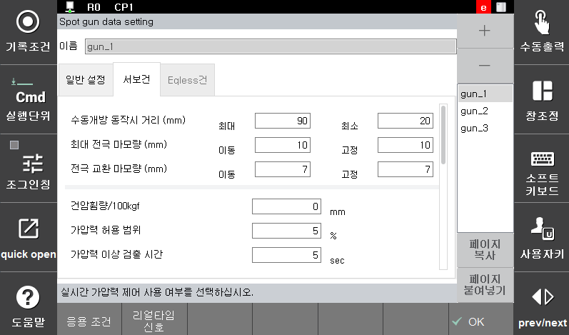

# 5.2.1.1 서보건 기본 설정

</img>
</img>
<em>
그림 5.2 서보건 기본 설정 화면
</em>

(1)  **수동 개방 동작시 거리(mm)**

    사용자 키에 의한 서보건 대개방과 소개방 동작에서 목표 위치를 지정합니다.
(2)  **최대 전극 마모량(mm)**

    건서치로 검출한 이동전극 또는 고정전극의 마모량이 설정된 값을 넘으면 에러를 출력하고 정지합니다.
(3)  **전극 교환 마모량(mm)**

    건서치로 검출한 이동전극 또는 고정전극의 마모량이 여기서 설정한 값을 넘으면 경고메시지와 함께 전극마모 경보신호를 출력하여 전극의 교환을 알립니다. 0.0mm로 설정하면, 이상 검출을 하지 않습니다.
(4)  **건암휨량/100\[Kgf]\(mm)**

    가압력에 의한 건 암의 휨량을 100Kgf에 대한 휨량으로 설정합니다. 스폿용접 수행 시 고정전극의 위치를 이 설정치와 지령 가압력으로부터 건 암 휨량을 산출하고 이를 보정하여 가압합니다.

</img>
<em>
그림 5.3 건 암 휨량/100Kgf 그래프
</em>

(5)  **가압력 정도(%)**

    가압 일치 검지시에 실 가압력이 지령 가압력과 비교하여, 가압력정도 범위내에 도달하면, 가압일치로 검지합니다. 0으로 설정되어 있으면, 『W0110 가압력 검지 않는 조건으로 설정됨』를 출력하고 가압 일치 검지를 하지 않습니다.
(6)  **가압력이상 검출시간(s)**

    가압동작 개시부터 가압 일치까지의 시간을 설정합니다. 이 시간 내에 가압일치가 되는 경우 즉시 용접신호를 출력합니다. 만약, 이 시간 내에 가압일치가 되지 않으면 『**E1314 가압력 일치 검지시간 초과입니다.**』를 출력하고 정지합니다. 0.0초로 설정하면, 가압 일치 검지를 계속 대기합니다.
(7)  **지령값 Offset(mm)**

    spot 명령문 실행 시 서보건에 의한 가압력을 발생시켜야 합니다. 이를 위해 이동전극을 가압위치로 이동하도록 명령합니다. 가압위치는 기록위치에 ‘지령값 offset’을 가압방향으로 더한 위치를 의미합니다.
(8)  **건타입**

    선택한 서보건의 타입(로봇건, 정치건)을 선택합니다. 정치 서보건을 사용하는 경우에 정치건의 좌표계를 미리 설정해 놓은 사용자 좌표계 번호를 설정합니다.(0인 경우 로봇 좌표계) 고정전극의 진행 방향이 Z(+)방향이 되도록 사용자 좌표계를 설정하십시오.

</img>
<em>
그림 5.4 정치건 좌표계
</em>

 
(9)  **이동전극 마모량/전체 마모량(%)**

    서보건의 마모량을 측정하는 방식은 건서치 1만으로 측정하는 방식과 건서치 1과 건서치 2 모두를 사용하여 측정하는 방식이 있습니다.

    0으로 설정된 경우에는 건서치 1과 건서치 2 모두를 사용하여 마모량을 계산합니다. 0이외의 값으로 설정된 경우에는 건서치 1로 측정한 전체 마모량을 설정된 비율(%)로 이동 전극 마모량과 고정전극 마모량을 분할하는 방식을 사용합니다.
(10)  **실시간 가압력 제어**

    실시간 가압력 제어 기능의 사용 유무를 설정합니다. 가압력계로 측정한 실제 가압력을 이용하여 설정한 가압력에 도달하도록 제어하는 기능입니다. 기능을 유효로 설정하면『 실시간 신호』키가 활성화되어 파라미터를 설정할 수 있습니다.
(11)  **가압력-전류 테이블**

    가압력계로 가압력을 측정하여 사용자가 원하는 범위의 가압력 테이블을 5단계로 작성할 수 있습니다. 가압력 테이블을 중력, 반중력 방향에서 구분하여 설정할 경우 건의 동작 방향에 따라 가압력을 보상합니다.

    이 가압력-전류테이블은 5레벨의 가압력에 대한 전류치를 설정합니다. 각 레벨이 증가할 수록 가압력-전류의 값도 증가하도록 설정합니다. 여기서 입력한 가압력의 상한치와 하한치는 재생 또는 수동조작시의 가압력의 제한 범위로 사용됩니다.

</img>
</img>
<em>
그림 5.5 중력방향, 반중력방향
</em>

