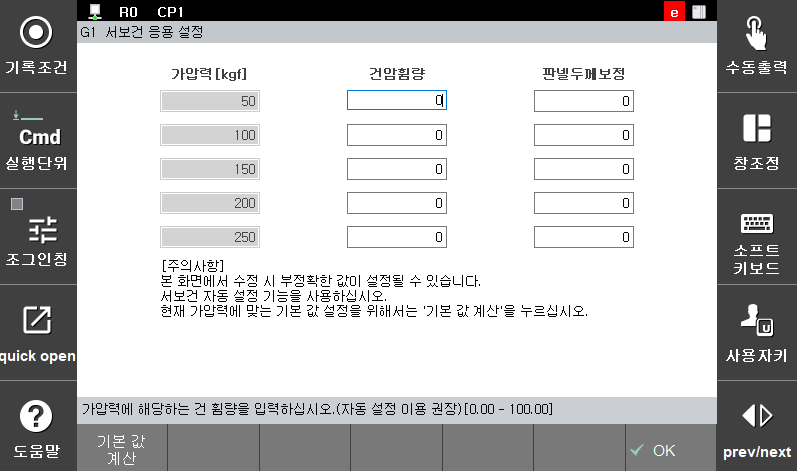

# 5.2.1.2 Servo gun application setting

</img>
<em>
Figure 5.7 Servo gun application setting
</em>

(1)  **Gun arm deflection amount (mm)**

     Sets the gun arm deflection amount for the squeezing force set on the left. Considering that it is difficult to manually measure and fill in the values, it is recommended to use servo gun automatic setting. If you press ‘Default value calculation’, the value of 0.31 mm per 100 kgf will be set as the default value.
 
(2)  **Panel thickness compensation(mm)**

      Sets the panel thickness compensation amount for the squeezing force set on the left. Considering that it is difficult to manually measure and fill in the values, it is recommended to use servo gun automatic setting.


[**Caution**]   When it comes to ‘gun arm deflection amount compensation’ and ‘panel thickness measurement compensation’, it is difficult to manually measure and fill in the values, it is recommended to use servo gun automatic setting.

The ‘gun arm deflection amount compensation’ value is a value used instead of the ‘gun arm deflection amount/100 kgf\[mm]’ among the servo gun parameters. When the ‘gun arm deflection amount compensation’ value is set, the already set ‘gun arm deflection amount/100 kgf\[mm]’ will not be used. On the contrary, if a ‘gun arm deflection amount compensation’ value is not set, the ‘gun arm deflection amount/100 kgf\[mm] will be used.’

