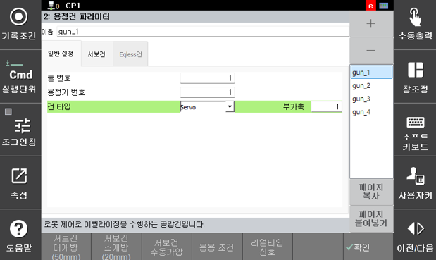

# 5.2 용접건 파라미터

용접건 파라미터는 스폿 작업을 위한 건을 추가하고, 건 타입에 맞게 상세 설정을 진행하는 방법을 설명합니다. 

</img>
<em>
그림 5.2.0 용접건 일반 설정
</em>

 

### 일반 설정

(1) 용접건의 추가와 삭제
  - 오른쪽 `[+]`, `[-]` 버튼을 이용하여 스폿건을 추가하거나 삭제합니다.
  - 최대 16개까지 추가할 수 있습니다.

(2) 툴 번호
  - 각 건의 기하학적인 정보를 '툴 테이터'에 미리 저장해 둡니다.
  - 각 건에 맞는 툴 테이터 번호를 입력합니다.

(3) 용접기 번호
  - 해당 건 번호에 연결된 용접기를 지정하는 것으로 해당 건으로 용접 시 해당 용접기 설정에 맞는 포트로 신호를 입, 출력 합니다. 
  - 최대 4대의 용접기를 지원하며, 최대 4개의 스폿건으로 동시용접 할 수 있습니다.

(4) 건 타입
  - 서보건 
    - 부가축으로 가압과 위치 제어를 수행하는 건입니다.
    - 선택시 부가축 번호를 추가로 입력합니다.
    - 부가축 설정은 서보건의 사양에 맞게 부가축 설정 기능에서 수행합니다.

  - Eq건 
    - 스폿건 자체적으로 이퀄라이징 기능을 가진 공압건입니다.
    - 스폿 명령 수행시 로봇이 서보건처럼 클리어런스 위치로 이동하는 과정이 없습니다.

  - Eqless건
    - 스폿건이 자체적으로 이퀄라이징 기능을 가지고 있지 않습니다.
    - 따라서 로봇 제어로 이퀄라이징을 수행하는 공압건입니다.
    - 스폿 명령 수행시 로봇이 클리어런스 위치로 이동하는 과정이 포함됩니다.
    
  - Eq-Brake 건 
    - 반발력으로 인한 로봇의 밀림을 방지하기 위해 로봇 축을 브레이크 고정하고 이퀄라이징을 수행하는 Eq건입니다.
    - 용접 시퀀스 설정에 몇 가지 추가 설정이 포함됩니다.
    - 로봇 R1축에 부착하는 로봇건에 대해서만 지원합니다.

 

건타입이 서보건 또는 EQless건인 경우는 각각의 건에 대한 개별 파라미터를 설정합니다.


Eq-Brake 건 타입은 용접 중 로봇 축이 브레이크로 고정되므로, 해당 명령문 실행 시 명령문 독립 실행의 MOVE 문을 통한 로봇 이동은 불가합니다.


