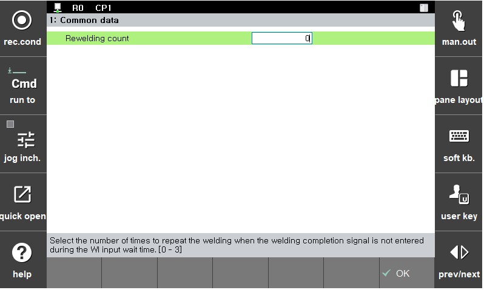

### 5.3.1 Common data

Sets the data to be commonly applied regardless of the spot welding sequence.

</img>
<em>
Figure 5.10 Common data setting
</em>

 

*  Number of re-weld attempts

    If the welding completion (WI) signal is not received within the configured welding completion wait time, re-welding will be performed. The number of re-weld attempts can be set up to three. If the WI signal is still not received after the specified number of re-weld attempts, an error will be generated.
