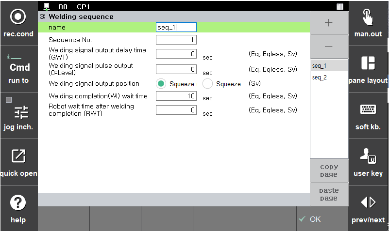

### 5.3.3 焊接顺序

设置点焊顺序，以根据工作环境定义机器人的操作。

</img>
<em>
图 5.14 焊接顺序设置
</em>

(1)  **序列号**
  - 允许快速选择所需的焊接序列。该编号通常对应于序列名称。

(2)  **焊接信号输出延迟时间 (GWT)**
  - 伺服枪：定义在挤压力匹配完成后焊接信号输出之前的等待时间。
  - 气动枪：定义在执行 `spot` 语句后焊接信号输出之前的等待时间。

(3)  **焊接信号脉冲输出 (0=水平)**
  - 指定焊接信号输出的持续时间。如果该值设置为 0，则焊接信号将持续输出，直到接收到焊接完成 (WI) 信号。

(4)  **焊接完成 (WI) 等待时间**
  - 指定接收焊接完成 (WI) 信号的等待时间。如果该值设置为 0，则系统将无限期地等待信号。

(5)  **焊接完成后机器人等待时间 (RWT)**
  - 通常指定在接收到焊接完成 (WI) 信号后等待沉积检测的时间。如果该值设置为 0.0，则不执行沉积检测。当使用沉积检测信号时，建议设置为大于 0.3 秒 (300 毫秒) 的值。然而，增大该值会延长焊接时间并增加整体循环时间。