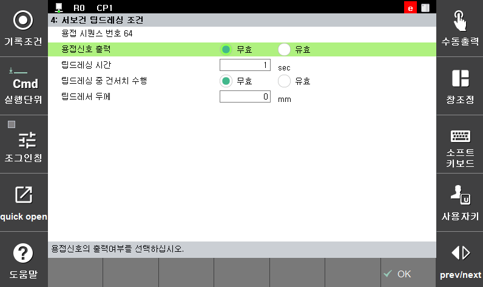

# 5.3.4 Servo gun tip dressing condition

Sets various conditions for the execution of tip dressing for the servo gun

 </img>
 <em>
Figure 5.15 Servo gun tip dressing condition setting 
</em>

 

(1)  **Welding signal output**

    Selects whether to output the welding signal for the tip dressing operation.
(2)  **Tip dressing time**

    Sets the time necessary for executing tip dressing. Tip dressing should be performed in the same manner by using the Spot statement. However, the welding sequence number should be set to “**64**.”
(3)  **Execution of gun search during tip dressing**

    Selects whether to execute gun search during tip dressing.
(4)  **Tip dresser thickness**

    Inputs the tip dresser thickness.
