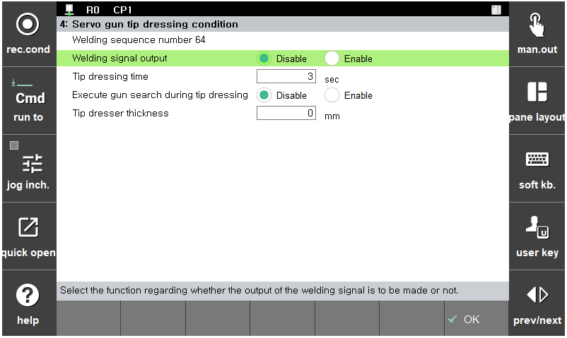

### 5.3.4 伺服枪尖整形条件

设置伺服枪尖整形执行的各种条件

 </img>
 <em>
图 5.15 伺服枪尖整形条件设置 
</em>

 

(1)  **焊接信号输出**
  - 选择是否输出用于尖整形操作的焊接信号。

(2)  **尖整形时间**
  - 设置执行尖整形所需的时间。尖整形应以相同的方式使用 `点 (spot)` 语句进行。但是，焊接序列编号应设置为 "**64**"。

(3)  **尖整形期间的枪搜索执行**
  - 选择是否在尖整形期间执行枪搜索。

(4)  **尖整形器厚度**
  - 输入尖整形器的厚度。