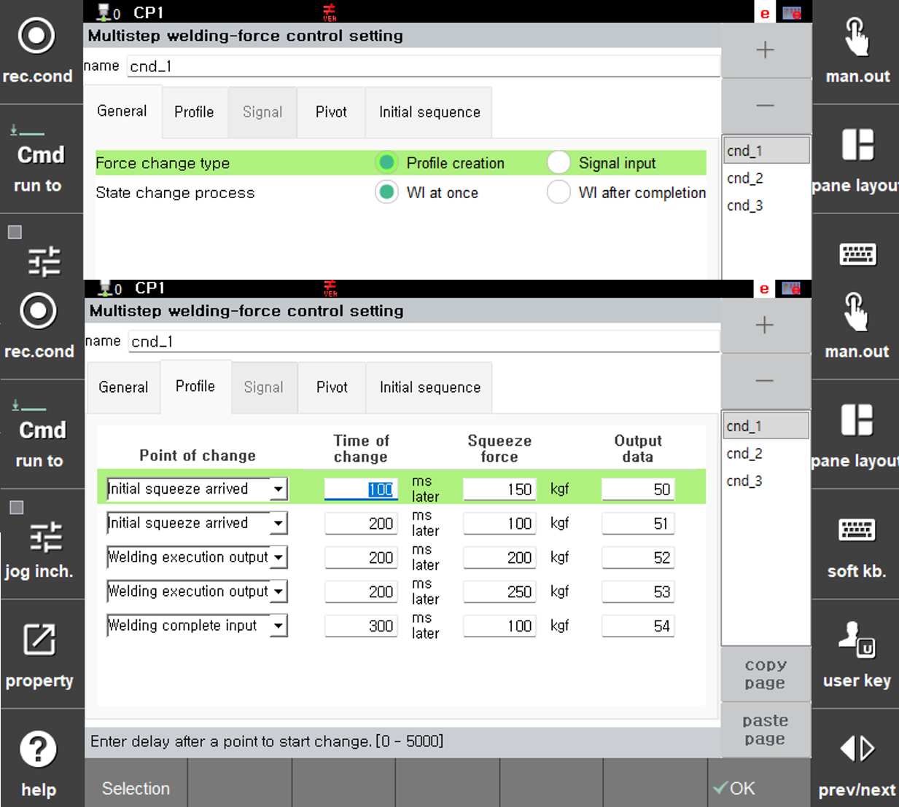
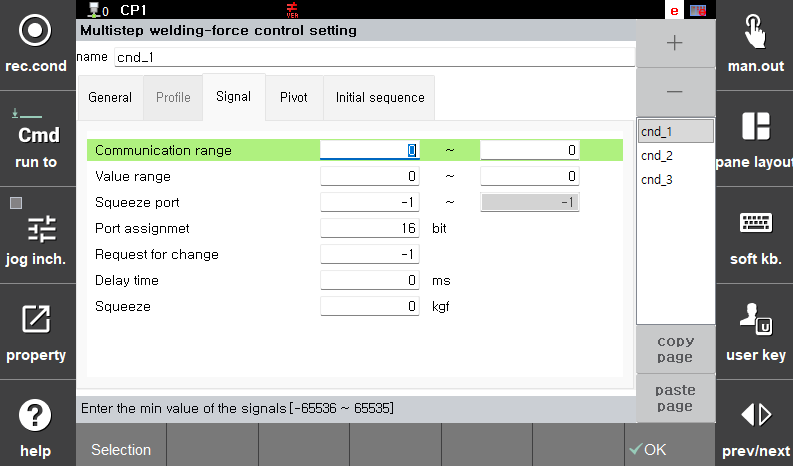

# 5.3.2.1.1 Multi-step squeezing force control

This function changes the pressurization force during pressurization in servo gun spot welding. The pressurization force can be changed either by generating a predefined profile or by a signal input.

</img>
</img>
<em>
Figure 5.12 Setting of multi-step squeezing force
</em>

 

(1)  **Condition number**  
  - Indicates the condition numbers for the multi-step squeezing condition and auxiliary conditions.  

(2)  **Force change type**  

   - Indicates the method to change the squeezing force. "Profile creation" is a method in which the point of time for change and the time required for change are designated and then the squeezing force is changed in order at the relevant point of time for change. "Signal input" is a method in which the squeezing force is changed when there is a signal input from an external device.

(3)  **State change process**  
   - When a WI signal is input while executing multi-stage pressurization conditions, select whether to process the WI signal immediately upon receipt or to process the WI signal after all multi-stage pressurization conditions have been completed. 

(4)  **\<Profile creation>**  
   - Will be activated when profile creation is selected as the method to change the squeezing force.

        * Point of time for change:  Specipies the point of time for starting multi-step squeezing by dividing the spot welding steps into \[**Initial squeezing force reached**] -> \[**Welding execution output**] -> \[**Welding completion input**].
        * Time required for change:  The squeezing force will be changed after the time required for change after the point of time for change is reached.
        * Squeezing force:  The target squeezing force to change to
        * Output data:  Output value transmitted in 12-bit format upon completion of pressurization
  
(5)  **\<Signal input>**  
  - Will be activated when the selected method to change the squeezing force is input of a signal. The information necessary for communication with external devices needs to be inputted.

    * Communication range:  Range from minimum to maximum of the assigned signal
    * Value range:  Minimum and maximum values of the assigned signal
    * Squeezing force port:  The number of the signal assigned for input
    * Port assignment:  The number of bits assigned to the signal
    * Request for change:  Port for the input signal for the request for change
    * Time of delay:  For inputting the time if a delay is needed after the input of the request
    * Squeezing force:  The requested squeezing force to change to. You can designate the squeezing force or receive an input signal. When the squeezing force is designated, the squeezing force for which a signal is received will be ignored.
