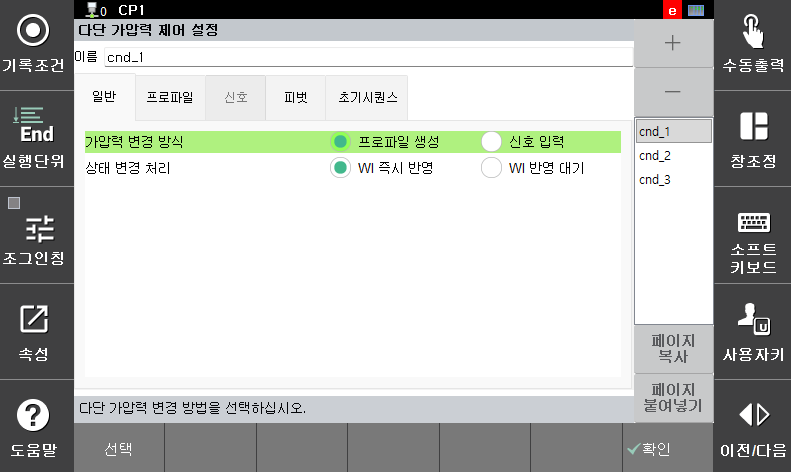
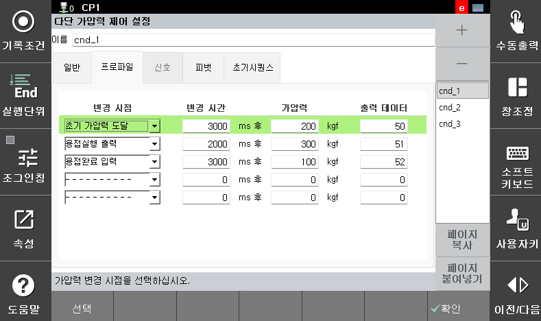
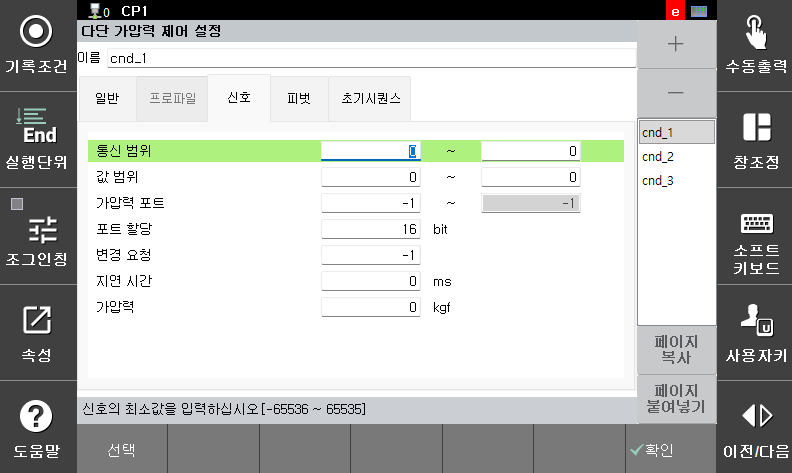

# 5.3.2.1.1 다단 가압 제어

서보건 스폿 용접에서 가압중인 가압력을 변경하는 기능입니다. 가압력 변경은 정해진 profile을 생성하여 변경시키는 방법과 신호 입력에 의해 변경시키는 방법이 있습니다.

</img>
</img>
</img>
<em>
그림 5.12 다단 가압 조건 설정
</em>

(1)  **조건 번호**
-  다단 가압 및 보조조건의 조건번호를 표시합니다.
      
(2)  **가압력 변경 방식**
-  가압력을 변경시킬 방법을 선택합니다. Profile 생성은 변경 시점과 변경 시간을 지정하여 순차적으로 해당 시점에 가압력을 변경시키는 방법입니다. 신호 입력은 외부 기기로부터 신호가 입력되면 가압력을 변경시키는 방법입니다.
  
(3)  **상태 변경 처리**
-  다단 가압 조건을 수행 중에 WI 신호가 입력될 경우, WI 신호를 수신 즉시 처리할지, 다단 가압 조건을 모두 수행하고 나서 WI 신호를 처리할지 선택합니다
  
(4)  **\<Profile 생성>**
-   가압력 변경 방법을 Profile 생성으로 선택한 경우 활성화됩니다.

     * 변경 시점: 스폿의 단계를 \[**초기 가압력 도달**] -> \[**용접실행 출력**] -> \[**용접완료 입력**]으로 구분하여 다단 가압 시작 시점을 지정
     * 변경 시간: 변경 시점 도달 후 변경 시간 이후에 가압력을 변경
     * 가압력: 변경할 목표 가압력
     * 출력 데이터: 가압완료시 12비트로 내보내는 출력값
  
(5)  **\<신호 입력>**

-  가압력 변경 방법을 신호입력으로 선택한 경우 활성화됩니다. 외부기기와 통신하기 위해 필요한 정보를 입력합니다.

   * 통신 범위: 할당된 신호의 최소, 최대 범위
   * 값 범위: 할당된 신호의 최소, 최대 값
   * 가압력 포트: 입력을 위해 할당된 신호의 번호
   * 포트 할당: 신호에 할당된 비트 수
   * 변경 요청: 변경 요청에 대한 입력 신호 포트
   * 지연 시간: 요청 입력 후 지연이 필요할 경우 시간 입력
   * 가압력: 변경 요청 가압력. 가압력은 지정하거나 신호로 입력 받을 수 있음. 가압력 지정 시 신호 입력으로 받은 가압력은 무시됨.
