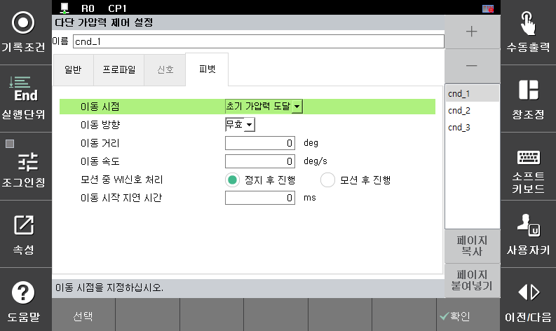

# 5.3.2.1.2 가압 중 건 이동(피봇)

서보건 스폿 용접에서 가압 중에 건을 이동시키는 기능입니다. 설정한 이동시점에 지정한 거리, 속도, 방향으로 로봇이 이동합니다. 본 기능은 툴 좌표계를 기준으로 로봇이 이동하는 기능이기 때문에 서보건 툴 데이터, 마모량, 건 암 휨, 티칭 자세, 로봇 캘리브레이션이 성능에 영향을 줄 수 있습니다. 기능의 효과적인 적용을 위해서는 상기 요소들을 지속적으로 관리해야 합니다.

</img>
<em>
그림 5.13 피봇 기능 설정
</em>

(1)  **조건번호**

    다단 가압 및 보조조건의 조건번호를 표시합니다.
(2)  **이동 시점**

    스폿의 단계를 [**초기 가압력 도달**] → [**용접실행 출력**] → [**용접완료 입력**]으로 구분하여 이동 시작 시점을 지정
(3)  **이동 방향**

    툴좌표계를 기준으로 건이 이동하는 방향을 선택합니다.
(4)  **이동 거리\[deg]**

    이동할 거리를 설정합니다.
(5)  **이동 속도\[deg/s]**

    이동할 속도를 설정합니다.
(6)  **이동 중 WI 입력 시 처리**

    로봇 이동 중에 용접 완료가 발생한 경우 이동을 멈출 것인지, 이동을 완료 후 다음 단계로 진행할 지 선택합니다.
(7)  **이동 시작 지연 시간**

    이동시점이 되었을 때 지연 시간 동안 대기 후 이동을 시작합니다.
