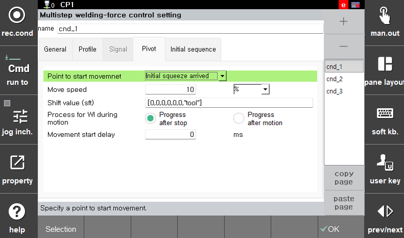

#### 5.3.2.1.2 Gun Movement During Pressurization (Pivot)

This function moves the gun during the pressurization phase in servo gun spot welding. At the specified movement timing, the robot moves by the defined distance, speed, and direction.

Since this function moves the robot based on the tool coordinate system, servo gun tool data, wear amount, gun arm deflection, teaching posture, and robot calibration can affect performance. To apply this function effectively, the above factors must be continuously monitored and managed.

</img>
<em>
Figure 5.13 Pivot setup
</em>

(1)  **Condition number**

-   Indicates the condition numbers for the multi-step squeezing condition and auxiliary conditions.
  
(2)  **Point to start movement**
-   Specifies the start timing of movement by dividing the spot welding stages into
`Initial squeeze arrived` → `Welding execution output` → `Welding complete input`.

(3)  **Shift value (sft)**
-   Regardless of whether a robot-mounted gun or a stationary gun is used, the coordinate system and movement position for shift movement are determined.

(4)  **Move speed\[mm/s, sec, %]**
-   Sets the movement speed.

(5)  **Process for WI during motion**
-   Selects whether to stop the movement immediately when welding completion occurs during robot movement, or to complete the movement and then proceed to the next step.

(6)  **Movement start delay**
-   When the movement timing is reached, the robot waits for the specified delay time before starting the movement.
