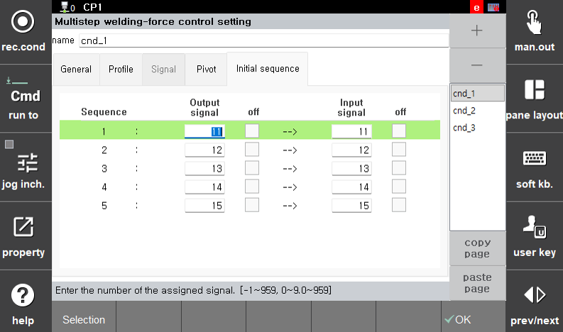

#### 5.3.2.1.3 初始顺序

多阶段压力设置条件不仅可以应用于点焊，还可以应用于其他焊接应用，例如异种材料结合。一些应用（例如，RSR）在达到初始压力后需要输入/输出信号顺序。

通过注册如下所示的顺序程序所需的输入/输出信号，系统在达到初始压力后完成信号输入/输出序列后，进入多阶段加压处理。

最多可提供五个顺序，用户可以根据需要配置多个。

 

</img>
<em>
图 5.13_1 初始顺序设置
</em>

