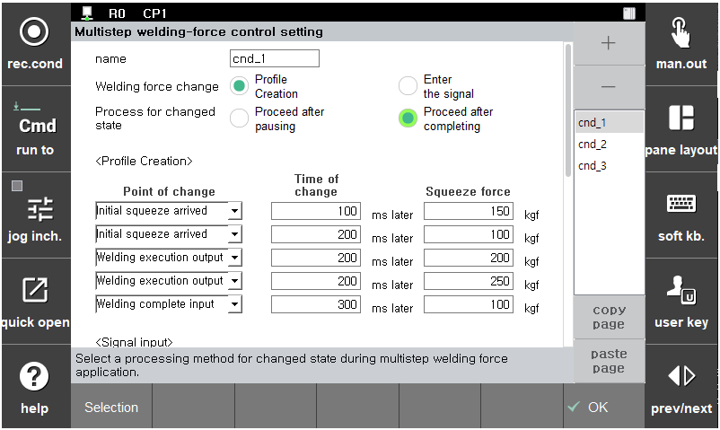
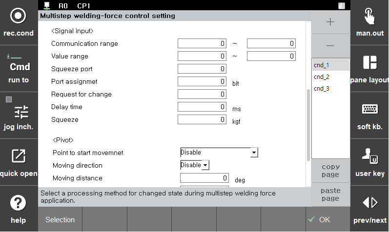

# 5.3.2.1.1 Multi-step squeezing force control

This is a function to change the squeezing force that is being applied during the spot welding with the servo gun. There are two methods to change the squeezing force. One is to change the squeezing force by creating a predetermined profile and the other is to change the squeezing force by using a signal input.

</img>
</img>
<em>
Figure 5.12 Setting of multi-step squeezing force
</em>

(1)  **Condition number**

   Indicates the condition numbers for the multi-step squeezing condition and auxiliary conditions.
(2)  **Initial squeezing force**

    Indicates the initial squeezing force set in the welding condition.
(3)  **Squeezing force change**

     Indicates the method to change the squeezing force. Creating a profile is a method in which the point of time for change and the time required for change are designated and then the squeezing force is changed in order at the relevant point of time for change. Using a signal input is a method in which the squeezing force is changed when there is a signal input from an external device.

(4)  **Handling upon change of state**

    If a state change occurs during a multi-step squeezing or while in a wait, this function makes it possible to select whether to proceed after stopping multi-step squeezing or proceed after completing multi-step squeezing.
(5)  **\<Profile creation>**

    Will be activated when profile creation is selected as the method to change the squeezing force.

 * Point of time for change: Designates the point of time for starting multi-step squeezing by dividing the spot welding steps into \[**Initial squeezing force reached**] -> \[**Welding execution output**] -> \[**Welding completion input**.] 
 * Time required for change: The squeezing force will be changed after the time required for change after the point of time for change is reached.
 * Squeezing force: The target squeezing force to change to
  
(6)  **<Signal input>**

    Will be activated when the selected method to change the squeezing force is input of a signal. The information necessary for communication with external devices needs to be inputted.

   * Communication range: Range from minimum to maximum of the assigned signal
   * Value range: Minimum and maximum values of the assigned signal
   * Squeezing force port: The number of the signal assigned for input
   * Port assignment: The number of bits assigned to the signal
   * Request for change: Port for the input signal for the request for change
   * Time of delay: For inputting the time if a delay is needed after the input of the request
   * Squeezing force: The requested squeezing force to change to. You can designate the squeezing force or receive an input signal. When the squeezing force is designated, the squeezing force for which a signal is received will be ignored.
