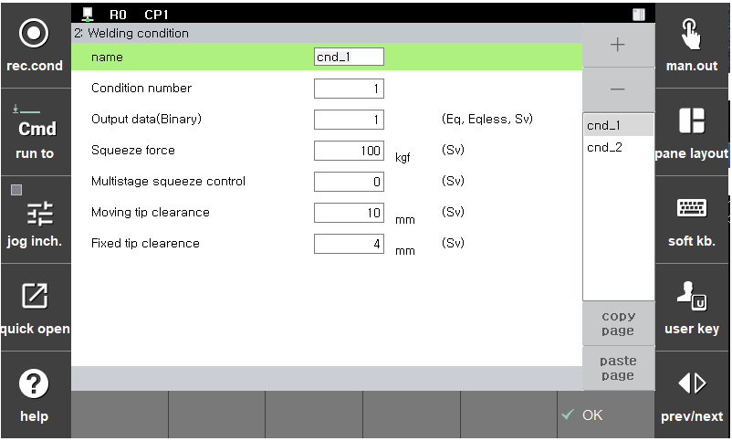

# 5.3.2 Welding condition

Sets the conditions related to spot welding to perform welding in line with the work environment.

</img>
<em>
Figure 5.11 Welding condition setting
</em>

(1)  **Condition number**

    Sets the welding condition quickly.
(2)  **Output data (binary)**

    Sets the data, which is to be inputted to the welder, for the welding condition number during the execution of the Spot statement.
(3)  **Initial squeezing force**

    Sets the squeezing force to squeeze the panel during the execution of the Spot statement. This will be used as the initial squeezing force during the setting of the multi-step squeezing force control.
(4)  **Multi-step squeezing force and auxiliary condition**

    This is an auxiliary condition number to manage the setting of multi-step squeezing force and pivoting. If a number is inputted, 『**Multi-step squeezing force**』 and  『**Pivoting**』 will be activated, making it possible to enter the menu.
(5)  **Moving electrode clearance**

    Sets the position where the moving electrode opens before and after the execution of the Spot statement.
(6)  **Fixed electrode clearance**

     Sets the position where the fixed electrode opens before and after the execution of the Spot statement.
