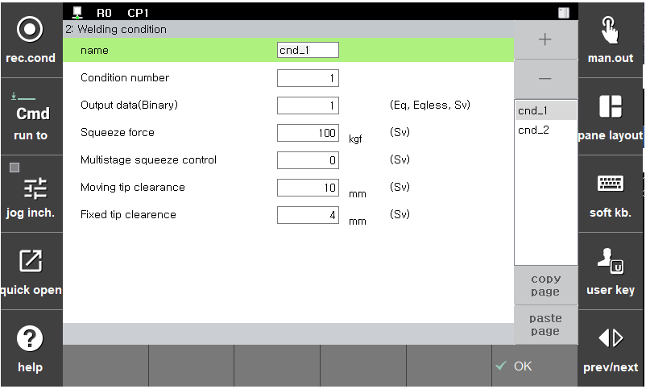

### 5.3.2 焊接条件

设置点焊条件，以便根据工作环境进行焊接。

</img>
<em>
图 5.11 焊接条件设置
</em>

(1)  **条件编号**  
  - 允许快速选择所需的焊接条件。该编号通常对应条件名称。

(2)  **输出数据（二进制）**  
  - 在执行 `点 (spot)` 语句时，设置要传输到焊机的指定焊接条件编号的数据。

(3)  **初始夹紧力**

  - 设置在执行 `点 (spot)` 语句期间施加的面板夹紧力。当配置多步骤夹紧力控制时，此值用作初始夹紧力。

(4)  **多步骤夹紧力和辅助条件**

  - 指定用于管理多步骤夹紧力和转动设置的辅助条件编号。如果输入一个数字，则必须在 `5: 多级压制条件` 菜单中编辑相应条件。

(5)  **移动电极间隙**
  - 设置在执行 `点 (spot)` 语句之前和之后移动电极的开启位置。

(6)  **固定电极间隙**
  - 设置在执行 `点 (spot)` 语句之前和之后固定电极的开启位置。