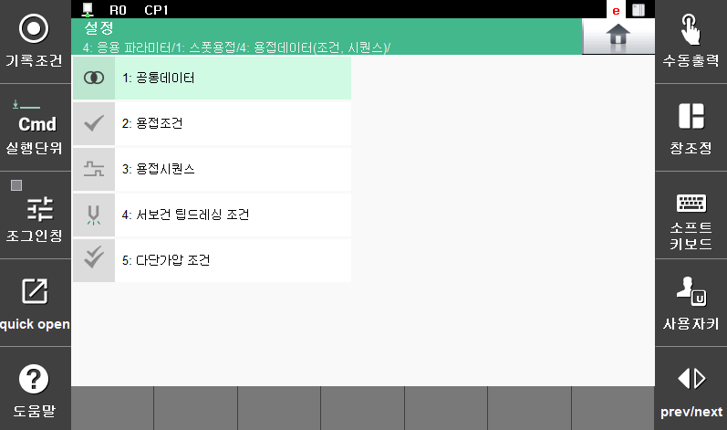

# 5.3 Welding data (condition, sequence)

Sets various parameters related to spot welding to perform appropriate operation in line with the work environment.

</img>
<em>
Figure 5.9 Welding data setting
</em>

