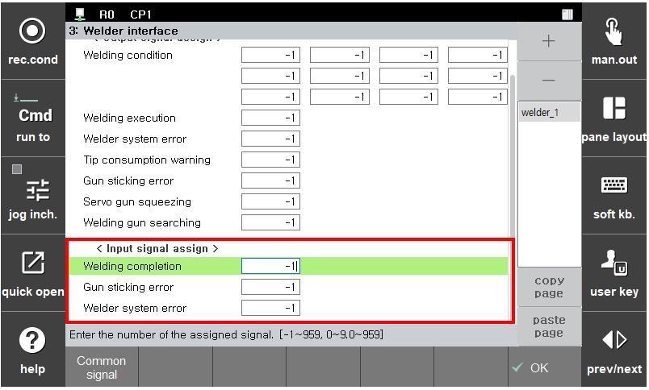

# 5.4 焊机的输入信号分配

分配与点焊相关的信号，使控制器能够监控其状态并进行必要的处理。

</img>
<em>
图 5.15 输入信号分配
</em>

(1)  **焊接完成**
  - 只有在点焊执行期间输入此焊接完成信号时，控制器才会执行焊接完成的处理。总共有四个焊接完成信号，它们是可以单独控制的。

(2)  **沉积错误**
  - 用于接收和处理枪的沉积信号的输入。

(3)  **焊机异常**
  - 用于在输入焊机异常信号时停止机器人的操作。