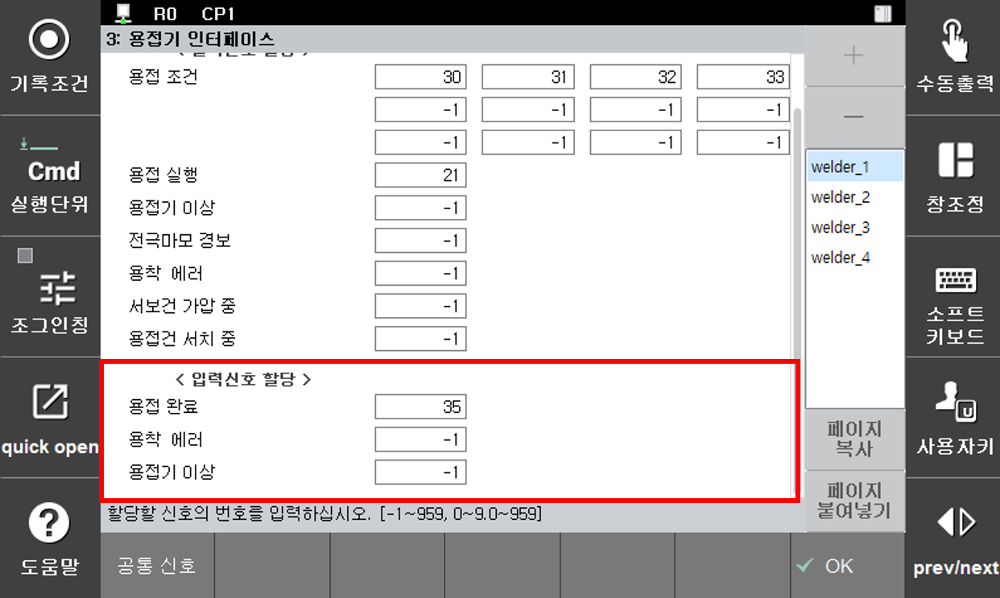

# 5.4 용접기별 입력 신호 할당

스폿용접과 관련된 신호를 할당하여 이들의 상태를 제어기가 감시하고 필요한 처리를 수행합니다.

</img>
<em>
그림 5.15 입력 신호 할당
</em>

(1)  **용접 완료**

    스폿용접 실행시 이 용접완료 신호가 입력되어야 제어기는 용접완료 처리를 수행합니다. 용접완료 신호는 총 4개로 개별적으로 제어가 됩니다.
(2)  **용착 에러**

    건의 용착 신호를 입력 받아 처리하고자 할 때 사용합니다.
(3)  **용접기 이상**

    용접기의 이상 신호가 입력되었을 경우에 로봇의 동작을 정지하고자 할 때 사용합니다.
