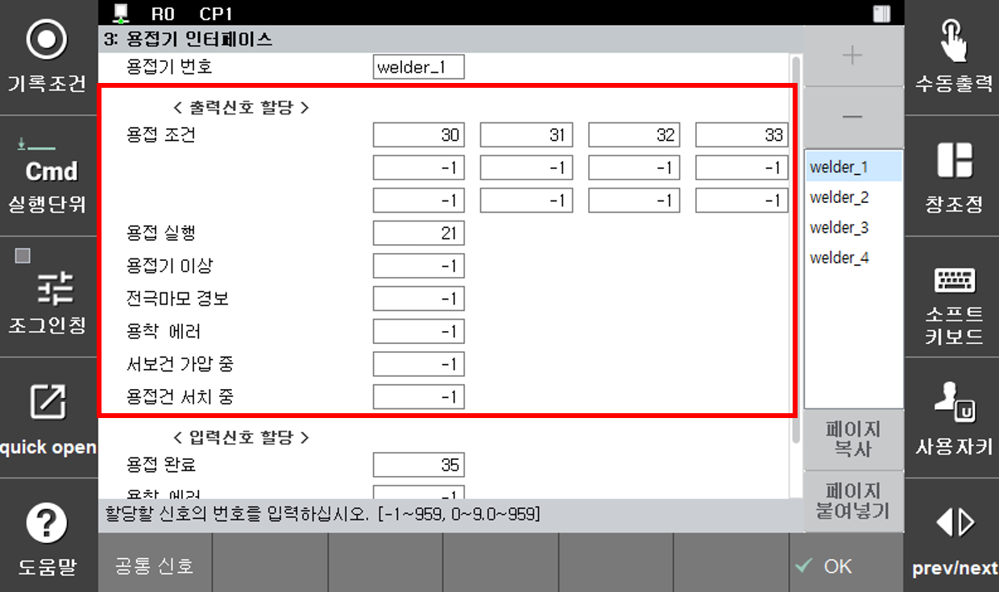

# 5.5 용접기별 출력 신호 할당

스폿용접과 관련된 신호를 할당하여 이들의 상태를 외부로 전달합니다.

</img>
<em>
그림 5.17 출력 신호 할당
</em>

(1)  **용접기 번호**
-    최대 4대까지 용접기를 추가할 수 있으며, 설정할 용접기 번호를 선택합니다.

(2)  **용접 조건**
-   spot 명령문 실행 시 용접조건에 해당하는 출력데이터를 출력할 신호의 번호를 할당합니다.

(3)  **용접 실행**
-  spot 명령 실행 시 용접기에 용접 명령을 출력할 때 사용합니다.

(4)  **용접기 이상**
-  스폿 용접기 이상 입력시 이를 외부로 출력하고자 할 때 사용합니다.

(5)  **전극마모 경보**
-  건서치로 검출한 마모량이 전극 교환 마모량보다 큰 경우에 신호를 출력하고자 할 때 사용합니다.

(6) **용착 에러**
-  스폿건에 용착이 발생하여 이를 외부로 출력하고자 할 때 사용합니다.

(7)  **서보건 가압 중**
-  spot명령문이 실행되어 가압을 개시할 때 ON된 후, 개방 개시 때 OFF되는 신호입니다.

(8)  **용접건 서치 중**
-  gunsea, igunsea, egunsea 명령이 실행되어 건서치을 개시할 때 ON된 후, 개방 개시 때 OFF되는 신호입니다.
    