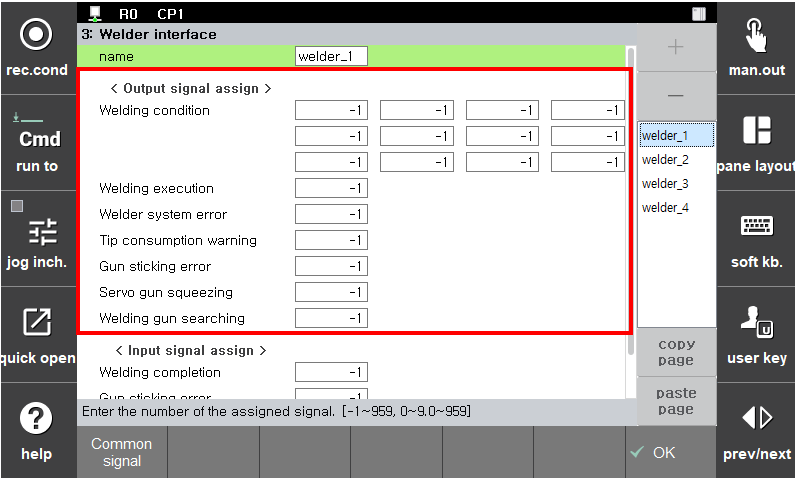

# 5.5 每个焊接工的输出信号分配

分配与点焊相关的信号，并将其状态传输到外部。

</img>
<em>
图 5.17 输出信号分配
</em>

(1)  **焊接工编号**
  - 选择要设置的焊接工编号。最多可以添加四个焊接工。

(2)  **焊接条件**
  - 分配信号的编号，以输出与在执行 `spot` 语句期间相应的焊接条件的输出数据。

(3)  **焊接执行**
  - 用于在执行 `spot` 语句期间向焊接工输出焊接命令。

(4)  **焊接工异常**
  - 用于将输入的点焊工异常信号输出到外部。

(5)  **电极消耗报警**
  - 用于在枪搜索检测到的消耗量大于所需更换电极的消耗量时输出信号。

(6) **沉积错误**
  - 用于将沉积发生状态输出到外部的点枪。

(7)  **伺服枪挤压进行中**
  - 这是一个信号，当执行 `spot` 语句时开始挤压时开启，并在打开操作开始时关闭。

(8)  **焊接枪搜索进行中**
  - 这是一个信号，当执行 `gunsea`、`igunsea` 或 `egunsea` 语句时开始枪搜索时开启，并在打开操作开始时关闭。