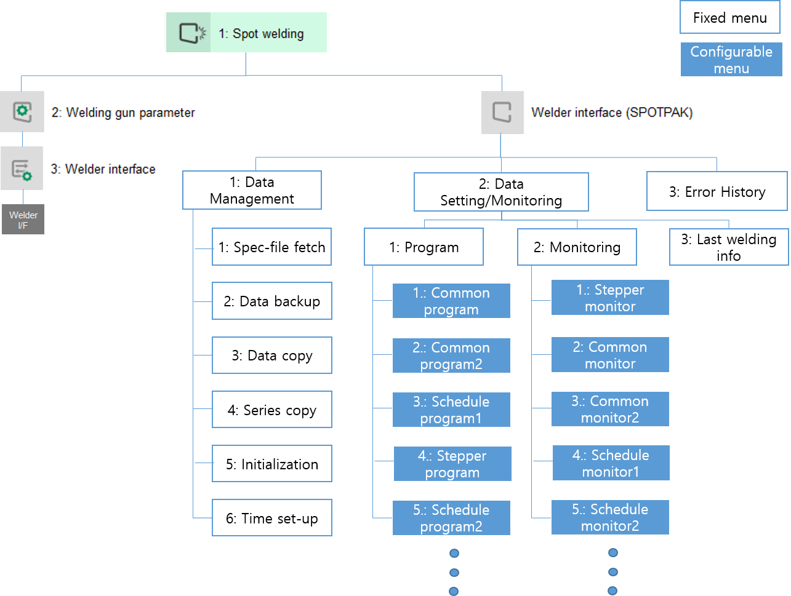

### 6.1.3 Menu Structure

The menu structure of the welder interface is dynamically configured according to the controller settings below.
To access these menus, the communication settings must first be correctly configured.

 

</img>
<em>
Figure 6.3 Menu Tree
</em>

